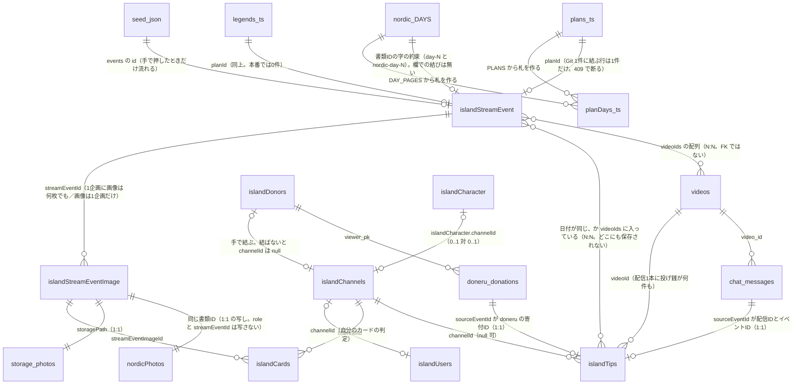

# あやと島カード — データの棚卸し

**この文書は事実だけを書く。** どう直すか・どちらがよいかは1行も書いていない。
元の思想は [`island-cards.md`](./island-cards.md)、置き場ぜんぶの設計は
[`island-db.md`](./island-db.md)、口の一覧は [`island-api.md`](./island-api.md)。

**数字は 2026-10-01 に測ったもの。** 測りかたは0章に書く。測っていないものは
「測っていない」と書いてある。**推測で埋めた数字は1つも無い。**

---

## 0. 測った日と、測りかた

| 何で測ったか | いつ | 何が分かるか |
| --- | --- | --- |
| `GET /island-api/cards?limit=1000` | 2026-10-01 | 配られたカード（**ただし上限 600枚**。6-7） |
| `GET /island-api/nextplans?events=1&limit=500` | 2026-10-01 | 企画のうち、隠していない・しまっていないもの |
| `GET /island-api/nordic/photos` | 2026-10-01 | 貼ってある写真ぜんぶと、日ごとの投げ銭の人数 |
| `GET /island-api/streamevents/{企画のID}/images` | 2026-10-01 | 企画ごとの画像と `role`。**ログインは要らない**（`island-api.md` 4章） |
| `GET /island-api/characters` | 2026-10-01 | 図鑑の件数 |
| GitHub Actions の run ログ（`投げ銭の台帳を入れ直す` #44、2026-10-01 07:36 UTC） | 2026-10-01 | **Firestore を直に数えた件数**（企画・カード画像・台帳・カード） |
| リポジトリの中身 | `5c740e9` | Git 側の表 |

**本番の Firestore には1バイトも書いていない。** 読んだのは公開の口と、
毎晩の run が自分で出しているログだけ。

**読めなかったもの**（推測で埋めていない）は 4.7 にまとめた。

---

## 1. 登場するデータ

### 1.1 一覧

| 置き場 | 名前 | 何を表すか | 鍵 | 件数（実測） |
| --- | --- | --- | --- | --- |
| Firestore | `islandStreamEvent` | 企画 | 書類ID（決め打ちと自動IDが混在） | **16**（隠していないもの。うち2件はしまってある） |
| Firestore | `islandStreamEventImage` | 企画に付く画像 | 自動ID | **69**（`role: "card"` ＋ `url` ＋ `streamEventId` を持つもの） |
| Firestore | `nordicPhotos` | **旧・写真。いまも公開の一覧はここを読む** | 上と同じ書類ID | **96**（口が返した写真の数） |
| Firestore | `islandTips` | 投げ銭の台帳 | `sourceEventId` の SHA-1 頭32文字 | **1,511**（`channelId` を持つもの） |
| Firestore | `islandCards` | 配られたカード | `<画像のID>__<チャンネルID>` | **617** |
| Firestore | `islandCharacter` | 図鑑（キャラクターの絵） | 自動ID（元はドライブの画像ID） | **99**（公開の口が返す数） |
| Firestore | `islandDonors` | どねID → チャンネルの対応表 | どねID（`viewer_pk`） | **31** |
| Firestore | `nordicDays` | 旧・その日いた人 | `YYYY-MM-DD` | 測っていない（毎晩書かれている。6-3） |
| Git | `site/content/plans.ts` の `PLANS` | これからの企画（人が書く） | `id` | **4** |
| Git | `site/content/legends.ts` の `LEGENDS` | やった企画（人が書く） | **`slug`** | **8** |
| Git | `site/content/nordic.ts` の `DAYS` | 北欧の旅程表 | `id`（`day-depart` / `day-1`…） | **17**（`DAY_PAGES` も17） |
| Git | `site/content/planDays.ts` の `PLAN_BY_DAY` | 日付 → その日の企画の札 | `YYYY-MM-DD` | **18日ぶん・21本** |
| Git | `python/stream_events_seed.json` | 企画の種（戻し先） | `events[].id` | **14** |

**`islandStreamEvent` の16件と、口が返す14件の差は「しまってある2件」。**
`listPlans`（`functions/src/islandApi.ts:1472`）が `archived` を落とすため。
隠してあるもの（`hidden`）があるかどうかは**読めない**（4.7）。

### 1.2 `islandStreamEvent` — 企画

| | |
| --- | --- |
| 何を表すか | **1本の企画。** 視聴者さんの提案も、Git に立ったページも、「北欧◯日目」も、全部この1つの入れ物に入る |
| 鍵 | 書類ID。**2通りある。** 人が出したものは Firestore の自動ID、運営側の種は決め打ち（`food-wine-fest` / `nordic-day-9`）。種の側は `python/admin/streamevents_import.py` が `col.document(r["id"])` で置く |
| 主な列 | `title` `when` `date`(YYYY-MM-DD) `status`(`proposed`/`next`/`done`) `planId` `videoIds[]` `source` `board` `hidden` `archived` `hearts` `uid` `cid` `createdAt` `updatedAt`。全部は [`island-db.md`](./island-db.md) 4.2 b |
| 誰が書くか | 視聴者さん（`POST /nextplans`）／あやと（段・`videoIds`・しまう）／`python/admin/streamevents_import.py`（種）／`python/admin/plans_relink.py`（二重を畳む） |
| 誰が読むか | `/board`（掲示板）、`functions/src/streamEvents.ts` の `loadEvents`（カードの組み立て）、`python/island_cards.py` の `load`、`/me` の「その日の配信」 |
| ルール | `firestore.rules:168` で `read, write: if false`。**ブラウザからは触れない。** 全部 Functions 経由 |

### 1.3 `islandStreamEventImage` — 企画に付く画像

| | |
| --- | --- |
| 何を表すか | **写真1枚。** 実体は Cloud Storage（`nordic/photos/{日}/{imageId}.{jpeg\|webp}`） |
| 鍵 | 自動ID。**この書類IDがカードIDの前半になる**ので、変えるとカードがはぐれる |
| 主な列 | `streamEventId`（**空なら、まだどの企画にも付いていない**）`role`（`card`/`gallery`/`cover`）`day` `storagePath` `url`（合言葉つき）`w` `h` `note` `takenAt` `sortOrder` `uid` `at` |
| 誰が書くか | あやとだけ。`functions/src/islandApi.ts` の `saveEventImage`（`POST /nordic/photos` と `POST /streamevents/{id}/images` の両方がここに来る）。付け替えは `POST /streamevents/images/{id}`、消すのは `DELETE` |
| 誰が読むか | `cardImagesOf`（`streamEvents.ts:345`）、`listCards`（`cards.ts:505` の `getAll`）、`python/island_cards.py` の `load`、`GET /streamevents/{id}/images` |
| 件数 | 69（`role: "card"` ＋ `url` ＋ `streamEventId` あり。2026-10-01 の run ログ「カード画像 69枚」） |

**`role: "card"` だけがカードになる。** `POST /nordic/photos` は `role` を
`"card"` に決め打ちしている（`islandApi.ts:2559`）。本番で見えている69枚は全部 `card`。

### 1.4 `nordicPhotos` — 旧・写真（**いまも公開の一覧はここを読む**）

| | |
| --- | --- |
| 何を表すか | 1.3 の**写し。** 書類IDは同じ |
| 持っている列 | `day` `path` `url` `w` `h` `note` `at` `uid` の8つだけ（`islandApi.ts:2132`）。**`role` も `streamEventId` も写していない** |
| 誰が書くか | `saveEventImage` が新旧へ同時に書く。消すのは `dropEventImage`（`islandApi.ts:2153-2171`）が両方 |
| 誰が読むか | **`listPhotoDays`（`islandApi.ts:2196`）だけ。** これが `GET /nordic/photos` の中身で、**あやと島カードの一覧（`/cards`）の土台**（`site/components/cards/cards.ts` の `useCardWall`） |
| 件数 | **96**（`GET /nordic/photos` の `days[].photos` を数えた） |
| 上限 | `orderBy("at","desc").limit(400)` |

### 1.5 `islandTips` — 投げ銭の台帳

| | |
| --- | --- |
| 何を表すか | **投げ銭1件。** YouTube のスパチャと Doneru の寄付を1本にしたもの |
| 鍵 | `sourceEventId`（`yt:<videoId>:<eventId>` か `doneru:<donationId>`）の **SHA-1 の頭32文字**。同じ寄付なら毎回同じIDになるので、流し直しても増えない |
| 主な列 | `source` `channelId`（**null あり**）`day`（**日本時間で切った日**）`donatedAt` `videoId` `videoStartedAt` `amount` `currency` `settlementAmount` `displayNameSnapshot` `viewerPk` |
| 誰が書くか | `python/island_tips.py` だけ。毎晩7日ぶんを引き直す |
| 誰が読むか | `tipsForEvent` / `channelsOfDay`（`streamEvents.ts`）、`python/island_cards.py`、`python/build_residents.py`（島に出る重み） |
| 件数 | **1,511**（`channelId` を持つもの。run ログ「台帳 1511件」）。`channelId` が null のものを含めた全体は**読めない**（4.7） |
| ルール | `firestore.rules:184` で閉じてある。**金額を持つので、本人以外に見えてはいけない**（[`island-db-notes.md`](./island-db-notes.md) 10） |

### 1.6 `islandCards` — 配られたカード

| | |
| --- | --- |
| 何を表すか | **「この画像を、この人がもらった」1枚。** |
| 鍵 | **`<画像のID>__<チャンネルID>`。** 決め打ちなので、2か所から作っても同じ書類になる（`streamEvents.ts:200`） |
| 主な列 | `channelId` `streamEventId` `streamEventImageId` `day`（**企画の日。投げ銭の日ではない**）`earnedAt`（＝`donatedAt`）`nameSnapshot` `x` `y` `rot` `scale` `movedBy` `movedAt` |
| 誰が書くか | `functions/src/streamEvents.ts` の `mintCards`（`mintForImage` / `resyncCardsOfImage` から）と `python/island_cards.py`。置き方を動かすのは `POST /cards/{cardId}` |
| 誰が消すか | `dropCardsOfImage`（画像を消したとき）と `resyncCardsOfImage`（画像を付け替えて、渡らなくなった人のぶん）。**毎晩のジョブは1枚も消さない** |
| 誰が読むか | `GET /cards`（`/cards`・`/about` の `CardStrip`・`/friends` の `FriendsWall`）、`GET /cards/mine`（`/me` の `MyPage`） |
| 件数 | **617**（run ログ「そのまま 617枚」。新しく作る0・素性を足す0なので、あるべき枚数と置いてある枚数が一致している） |
| 置き方 | 本番 600枚のうち **`moved` が立っているものは0枚。** `x` は 0.621〜0.880、`scale` は 0.92〜1.08 が入っているが、画面は `moved` でないかぎりこの値を使わない（`cards.ts` の `cardPlace`） |

**台帳への参照は持っていない。** どの投げ銭から出たカードかは、書類のどこにも
入っていない。残っているのは `earnedAt`（投げ銭の時刻）と `nameSnapshot` だけ。

### 1.7 `islandCharacter` — 図鑑

| | |
| --- | --- |
| 何を表すか | キャラクターの絵1体。**カードに乗る絵の正本** |
| 鍵 | 書類ID（元はドライブの画像ID）。`icon` としてカードの応答に出る |
| カードに効く列 | `channelId`（**引く順の1番目**）`lookupKeys`（受け皿）`emoji` |
| 誰が書くか | あやと（`POST /characters`・`POST /characters/{id}`）、`python/admin/characters_link.py`、`python/admin/channel_alias.py`（毎晩） |
| 誰が読むか | `functions/src/cards.ts` の `characterBook`（5分の控えつき）、`python/build_residents.py` |
| 件数 | **99**（`GET /characters` の `total`）。`channelId` が何件入っているかは公開の口に出ないので**読めない** |

### 1.8 鍵として出てくるもの

| 名前 | カードにどう効くか |
| --- | --- |
| `islandDonors` | どねID → チャンネルID。**ここで紐付いていない Doneru の寄付は `channelId: null` のまま台帳に入り、カードにならない。** 31件 |
| `islandChannels` | **カードの道では1回も読まれない**（`cards.ts` の長い注。絵を名乗りで引いていたころの名残） |
| `islandUsers` | `channelId` で「自分のカード」を決める（`/cards/mine` と `POST /cards/{cardId}`）。送られてきた値は信じない |
| `nordicDays` | 旧・その日いた人。**カードの道からは読まれていない**（6-3） |

### 1.9 Git 側

| ファイル | 何を表すか | 鍵 | 件数 | 誰が書くか | 誰が読むか |
| --- | --- | --- | --- | --- | --- |
| `site/content/plans.ts` の `PLANS` | これからの企画のページ | `id` | 4（`food-wine-fest` `georgia-bye` `japan-2years` `nordic`） | 人 | `/next`、`PLAN_BY_DAY`、`islandStreamEvent.planId` の相手 |
| `site/content/legends.ts` の `LEGENDS` | やった企画のページ | **`slug`** | 8 | 人 | `/legends/{slug}`、`planId` の相手 |
| `site/content/nordic.ts` の `DAYS` | 旅程表。1日1行 | `id` | **17**（`day-depart` ＋ `day-1`〜`day-16`。2026-09-11〜09-27） | 人 | `/nordic`、`DAY_PAGES`、`PLAN_BY_DAY` |
| `site/content/nordic.ts` の `DAY_PAGES` | 面のある日 | 同上 | **17**（`legs` か `city` を持つ行。いまは全部持っている） | — | `PLAN_BY_DAY`、`/nordic/day/{slug}` |
| `site/content/planDays.ts` の `PLAN_BY_DAY` | **日付 → 企画の札。カードの紙の見出しはここから出る** | `YYYY-MM-DD` | **18日・21本** | — | `/cards`・`/friends`・`/me`（面＝server で引いて値だけ渡す） |
| `python/stream_events_seed.json` | 企画の種。**最初の1回と、Firestore が飛んだときの戻し先** | `events[].id` | **14** | 人 | `python/admin/streamevents_import.py`（**手で押したときだけ**。`run_admin_script.yml`） |
| `site/content/chapters.ts` の `CHAPTERS` | 章＝島 | `slug` | — | 人 | 島の連なり。**カードとは日付の範囲でしか繋がらない**（2.3） |

`PLAN_BY_DAY` の中身（`planDays.ts:43`）:

| 日 | 札 |
| --- | --- |
| 2026-09-06 | Food & Wine Fest @ ムタツミンダ公園 |
| 2026-09-11 | ジョージアバイバイ／海外出発二周年記念日／ヒッチハイクで北欧へ／北欧旅 出発 |
| 2026-09-12 〜 2026-09-27 | 「北欧旅 1日目」〜「北欧旅 16日目」（16日ぶん・1日1本） |

---

## 2. リレーション

### 2.1 ERD



読み方は [`island-db.md`](./island-db.md) 1.1 と同じ。`snake_case` は BigQuery、
`islandXxx` と `nordicXxx` は Firestore、`_ts` / `_json` / `nordic_DAYS` は Git、
`storage_photos` は Cloud Storage。

### 2.2 多重度と、鍵がどこにあるか

| 左 | 右 | 多重度 | 鍵を持っているのはどちらか |
| --- | --- | --- | --- |
| 配信 | 投げ銭 | 1 : N | 投げ銭（`islandTips.videoId`）。Doneru のぶんは**時刻を配信の時間帯に当てて埋めている**（`island_tips.py` の `SQL_DONERU`） |
| 配信 | 企画 | **N : N** | 企画（`islandStreamEvent.videoIds[]`）。**配信の側は何も持たない** |
| 日付 | 企画 | 1 : N | 企画（`islandStreamEvent.date`）。1日に企画は何本でも立つ |
| 企画 | 画像 | 1 : N | 画像（`islandStreamEventImage.streamEventId`）。**1枚は1企画にしか付かない** |
| 画像 | カード | 1 : N | カード（`islandCards.streamEventImageId`） |
| 投げ銭 | カード | **N : N（導出）** | **どちらも持たない。** カードは「画像 × 人」で決まるので、元の投げ銭に戻る道が無い |
| 人 | カード | 1 : N | カード（`islandCards.channelId`） |
| 人 | 絵 | 0..1 : 0..1 | 図鑑（`islandCharacter.channelId`）。受け皿は `islandCards.nameSnapshot` → `lookupKeys` |
| 企画 | Git の企画 | 0..1 : 0..1 | 企画（`islandStreamEvent.planId`）。**Git 1件に結ぶ行は1件だけ** |
| 章 | ほか全部 | — | **どこにも鍵が無い。** `chapters.ts` の `from` / `to` の範囲に日付が入っているか、それだけ |

### 2.3 7つが、どう結ばれているか

```
章（Git の chapters.ts）
  └ 日付の範囲でしか結ばれない。Firestore に章の欄は1つも無い

日付（YYYY-MM-DD）
  ├ islandStreamEvent.date      … 企画がその日のものだと言う
  ├ islandTips.day              … 日本時間0時で切った配信日
  ├ islandStreamEventImage.day  … 写真がその日のものだと言う
  └ islandCards.day             … **企画の日を写したもの。投げ銭の日ではない**

配信（YouTube の動画）
  ├ islandTips.videoId          … どの配信の投げ銭か
  └ islandStreamEvent.videoIds[] … 人が「この配信はこの企画」と決めた印（N:N）

企画 ──┬─ 画像（1:N・streamEventId）─── カード（1:N・streamEventImageId）
       └─ 投げ銭（N:N・日付か videoIds で当たる）── カード（channelId）
```

**カードは「画像 × 人」の掛け算で、鍵は `<画像のID>__<チャンネルID>`。**
だから同じ日に写真が14枚あって8人が投げていれば、カードは 112枚できる
（本番の 2026-09-20 がちょうどそれ）。

### 2.4 [`island-db.md`](./island-db.md) の ERD との差

| | |
| --- | --- |
| **食い違わない** | 1.1 と 1.3 に書いてある矢印は、どれもいまの実装と向きも多重度も合っている |
| **1.1 にも 1.3 にも無い** | `islandCharacter`（カードに乗る絵の正本）、`nordicPhotos` と `islandStreamEventImage` の 1:1、`islandStreamEvent` と `videos` の N:N（配列で持つところ）、Git の `nordic.ts DAYS` → `islandStreamEvent`、`stream_events_seed.json` → `islandStreamEvent` |
| **1.3 の列の説明が本番と違う** | `islandStreamEvent.id PK "Firestore の自動ID"`。本番14件のうち**12件は決め打ちのID**で、自動IDは2件だけ（6-10） |
| **矢印はあるが、欄が無い** | `islandTips ||--o{ islandCards : "誰に配るかを決める"`。関係は本当にあるが、**カードは台帳のIDを1つも持っていない**（6-11） |

---

## 3. カードが1枚できるまで

### 3.1 揃わないといけないもの

```
(1) 企画が1件ある          islandStreamEvent        hidden でないこと
(2) その企画に画像が付く    islandStreamEventImage   role: "card" ＋ url ＋ streamEventId
(3) その企画に投げ銭が当たる islandTips              channelId が入っていること
      当たり方は2つ。両方を足す（片方で打ち切らない）
        a. 企画の videoIds に、その投げ銭の videoId が入っている
        b. 企画の date と、その投げ銭の日が同じ
(4) 同じ人が同じ日に何度投げても1枚。**いちばん早い1回**を採る
(5) 書類ID = <画像のID>__<チャンネルID>
```

### 3.2 入口A — 画像を貼ったとき（`functions/src/streamEvents.ts` の `mintForImage`）

```
POST /nordic/photos  または  POST /streamevents/{企画のID}/images
  → islandApi.ts:2027  saveEventImage()
      ├ 中身の頭を見て jpeg / webp か決める          （違えば 400）
      ├ 企画を決める：打たれたID、無ければその日のいちばん古い企画
      │   ここで決まらないと streamEventId は "" のまま（islandApi.ts:2074-2077）
      ├ 1日の枠を取る（PHOTOS_PER_DAY）             （超えれば 429）
      ├ Storage に置く → islandStreamEventImage に書く → nordicPhotos にも書く
      └ streamEventId があれば mintForImage()       （islandApi.ts:2135-2142）
          └ streamEvents.ts:493  mintForImage(image)
              ├ role が card でなければ 0枚         （:494）
              ├ 企画の書類が無ければ 0枚            （:496）
              ├ tipsForEvent(ev)  … day の等価 ＋ videoId の in（索引を増やさない）
              └ mintCards([image], tips, ev.date)
```

### 3.3 入口B — 毎晩（`python/island_cards.py`）

```
Fetch Doneru Donations が終わる
  → .github/workflows/tips_after_doneru.yml（workflow_run。cron 30 1 * * * は保険）
      1. doneru_supporters.py   どねID の対応表
      2. island_tips.py         台帳を7日ぶん引き直す
      3. island_cards.py        カード
           load()  … 企画ぜんぶ・カード画像ぜんぶ・台帳ぜんぶを読む
           events_for_tip()  … 投げ銭1件 × 企画ぜんぶ を総当たり
           want{} に <画像のID>__<チャンネルID> を積む
           get_all でいまの書類を引いて、作る / 素性を足す / そのまま に分ける
           batch.set(merge=True)   ← **置き方（x/y/rot/scale）には触らない**
```

**この3本は `schedule_fetch_chat.yml` の `island_stats` ジョブからも回る。**
同じ晩に2回走っても、書類IDが決め打ちなので増えない。

### 3.4 2つの入口で違うところ

| | 入口A（TypeScript） | 入口B（Python） |
| --- | --- | --- |
| 企画の当て方 | `tip.day` と `e.date` を比べる（`streamEvents.ts:259`） | **`videoStartedAt` があれば、そちらを日本時間に直した日**で比べる（`island_cards.py:162-164`） |
| 画像の `role` が空のとき | `card` とみなす（`imageRef`） | `card` とみなす（`load`） |
| 置き方の既定値 | `defaultPlace`（`streamEvents.ts:571`） | `default_place`（`island_cards.py:111`）。**式も定数も同じ** |
| 消すか | `resyncCardsOfImage` だけが消す | **1枚も消さない** |

`videoStartedAt` は **`functions/` の中に1回も出てこない**（`grep` で確認）。

### 3.5 黙って0枚になる分岐（全列挙）

**「落ちた」と分かる形にならないもの**だけを並べる。例外で止まるものは入れていない。

| # | どこ | 条件 | 何が起きるか |
| --- | --- | --- | --- |
| 1 | `functions/src/islandApi.ts:2074-2077` | 貼った日に企画が1件も無く、企画IDも打たれていない | `streamEventId: ""` で画像だけ置かれる。`mintForImage` は呼ばれない。**ログに `warn` が1行出るだけ**（`image with no stream event`） |
| 2 | `functions/src/islandApi.ts:2137-2141` | `mintForImage` が落ちた | `catch` して `warn`。写真は貼れているので、画面は成功に見える |
| 3 | `functions/src/streamEvents.ts:494` | `image.role !== "card"` | `{made: 0}`。`gallery` / `cover` はカードにならない |
| 4 | `functions/src/streamEvents.ts:496` | `!snap.exists`（企画の書類が無い） | `{made: 0}` |
| 5 | `functions/src/streamEvents.ts:282` | `tipsForEvent`：企画が `date` も `videoIds` も持たない | `[]`。日付未定の提案に画像を付けると、ここで止まる |
| 6 | `functions/src/streamEvents.ts:385` | `mintCards`：`whoKey(t.channelId)` が空（＝`channelId` が null） | その投げ銭を飛ばす。**Doneru の紐付いていない人がここ** |
| 7 | `functions/src/streamEvents.ts:395` | 画像 × 人 が0通り | `{made: 0}` |
| 8 | `functions/src/streamEvents.ts:232` | `loadEvents`：`hidden === true` の企画 | 企画ごと落ちる。`board: false` では落ちない（**出さないのと、無いことにするのは別**） |
| 9 | `functions/src/streamEvents.ts:353` | `cardImagesOf`：`role !== "card"` か `url` が空 | その画像を飛ばす |
| 10 | `python/island_cards.py:197` | `(role or "card") != "card"` か `url` が空 | その画像を飛ばす |
| 11 | `python/island_cards.py:200-202` | `streamEventId` が空 | **その画像はどの企画にも載らない。** 1 で作られた画像がここに来る |
| 12 | `python/island_cards.py:187-188` | `hidden is True` の企画 | 企画ごと落ちる |
| 13 | `python/island_cards.py:211-213` | `channelId` が空の台帳 | その投げ銭を飛ばす |
| 14 | `python/island_cards.py:260-261` | `want` が空 | `return 0`。**ログは「あるべきカード: 0枚」で、run は緑** |
| 15 | `python/island_cards.py:166-172` | `events_for_tip` が1本も返さない（その日の企画が無い） | その投げ銭にカードが付かない |

**できたあとに、画面から消える分岐**（カードの書類はあるのに出ない）:

| # | どこ | 条件 | 何が起きるか |
| --- | --- | --- | --- |
| 16 | `functions/src/cards.ts:67 / :484` | `MAX_CARDS = 600` を超えたぶん | `orderBy("earnedAt","desc").limit(600)` で**古いほうから切れる**。`limit` クエリは読まれていない |
| 17 | `functions/src/cards.ts:535` | `!im || !im.url`（画像の書類が消えている） | そのカードを返さない |
| 18 | `functions/src/cards.ts:441-444` | `pickIcon`：同じ `channelId` が2人の図鑑に付いている | 絵を当てない。**絵の無いカードは画面に出ない** |
| 19 | `functions/src/cards.ts:502-508` | `imageIds` が `MAX_IMAGES = 600` を超えた | 超えたぶんの画像が引かれず、17 に落ちる |
| 20 | `site/components/cards/CardSheet.tsx:68` | 同じ写真に同じ絵のカードが2枚ある | 2枚目を候補に出さない（`picks` が `icon` で畳む） |

---

## 4. いまの本番の実測（2026-10-01）

### 4.1 `islandStreamEvent` — 全14件、日付順

| 日 | 書類ID | 段 | `planId` | `videoIds` | ハート | 題 |
| --- | --- | --- | --- | --- | --- | --- |
| 2026-09-06 | `food-wine-fest` | next | `food-wine-fest` | **2本** | 0 | Food & Wine Fest @ ムタツミンダ公園 |
| 2026-09-11 | `nU5CtD9pWp97KeGtgK09` | next | `georgia-bye` | 0 | 2 | ジョージアバイバイ |
| 2026-09-11 | `V1ec66X2kj3p2ZqlX0Gt` | next | `japan-2years` | 0 | 2 | 海外出発二周年記念日 |
| 2026-09-11 | `nordic` | next | `nordic` | 0 | 0 | ヒッチハイクで北欧へ |
| 2026-09-11 | `nordic-day-depart` | next | — | 0 | 0 | 北欧旅 出発 — トビリシからクタイシ、夜の便でポーランドへ |
| 2026-09-12 | `nordic-day-1` | next | — | 0 | 0 | 北欧旅 1日目 — カトヴィツェからワルシャワへ |
| 2026-09-13 | `nordic-day-2` | next | — | 0 | 0 | 北欧旅 2日目 — ワルシャワからビャウィストクへ |
| 2026-09-14 | `nordic-day-3` | next | — | 0 | 0 | 北欧旅 3日目 — ビャウィストクからヴィリニュスへ |
| 2026-09-15 | `nordic-day-4` | next | — | 0 | 0 | 北欧旅 4日目 — ヴィリニュスで休息日 |
| 2026-09-16 | `nordic-day-5` | next | — | 0 | 0 | 北欧旅 5日目 — ヴィリニュスからリガへ |
| 2026-09-17 | `nordic-day-6` | next | — | 0 | 0 | 北欧旅 6日目 — リガで休息日 |
| 2026-09-18 | `nordic-day-7` | next | — | 0 | 0 | 北欧旅 7日目 — リガからタリンへ |
| 2026-09-19 | `nordic-day-8` | next | — | 0 | 0 | 北欧旅 8日目 — タリンからヘルシンキ、夜行フェリーでストックホルムへ |
| 2026-09-20 | `nordic-day-9` | next | — | 0 | 0 | 北欧旅 9日目 — ストックホルム到着 |

- **日付の範囲は 2026-09-06 〜 2026-09-20。** それより新しい企画は1件も無い
- 段は14件とも `next`。`proposed` も `done` も0件
- `planId` を持つのは4件。全部 `PLANS` のID で、`LEGENDS` の `slug` を持つ行は0件
- `videoIds` を持つのは**1件だけ**（`food-wine-fest` の2本）
- しまってある2件は読めない（4.7）。[`island-db-notes.md`](./island-db-notes.md) 9 の
  「二重になっていたものを `plans_relink.py` が畳んだ」ぶんと件数が合う

### 4.2 `islandCards` — 617枚。日ごとの枚数

公開の口（`GET /cards`）が返したのは **600枚**。残り17枚は上限で切れている（3.5 の16）。

| 日 | 写真 | その日投げてくれた人 | カード（口が返した枚数） | 写真 × 人 | 1枚あたり | 企画 |
| --- | --- | --- | --- | --- | --- | --- |
| 2026-09-30 | 1 | 3 | **0** | 3 | — | **無い** |
| 2026-09-29 | 2 | 7 | **0** | 14 | — | **無い** |
| 2026-09-27 | 1 | 3 | **0** | 3 | — | **無い** |
| 2026-09-26 | 7 | 3 | **0** | 21 | — | **無い** |
| 2026-09-23 | 8 | 9 | **0** | 72 | — | **無い** |
| 2026-09-22 | 3 | 3 | **0** | 9 | — | **無い** |
| 2026-09-21 | 5 | 3 | **0** | 15 | — | **無い** |
| 2026-09-20 | 14 | 8 | 112 | 112 | 8 | `nordic-day-9` |
| 2026-09-19 | 11 | 10 | 110 | 110 | 10 | `nordic-day-8` |
| 2026-09-18 | 8 | 12 | 96 | 96 | 12 | `nordic-day-7` |
| 2026-09-17 | 17 | **7** | **136** | 119 | **8** | `nordic-day-6` |
| 2026-09-16 | 9 | 9 | 81 | 81 | 9 | `nordic-day-5` |
| 2026-09-15 | 5 | 11 | 55 | 55 | 11 | `nordic-day-4` |
| 2026-09-14 | 1 | **8** | **9** | 8 | **9** | `nordic-day-3` |
| 2026-09-13 | 1 | 8 | **1** | 8 | 1 | `nordic-day-2` |
| 2026-09-12 | 1 | 5 | **0** | 5 | — | `nordic-day-1` |
| 2026-09-11 | 1 | 7 | **0** | 7 | — | `nU5CtD9pWp97KeGtgK09` |
| 2026-09-06 | 1 | 4 | **0** | 4 | — | `food-wine-fest` |

**止まっているのは 2026-09-20。** 2026-09-21 以降は、写真も投げ銭もあるのに
カードが1枚も無い（企画が無いため。6-1）。

**いちばん古く見えるのは 2026-09-13 の1枚。** 9/06・9/11・9/12 のぶんと、
9/13 の残り7枚は書類としてはあるが、上限600で切れていて公開の口から取れない（6-7）。

ほかの数字:

| | |
| --- | --- |
| 絵（`icon`）が付いていないカード | **0枚**／600 |
| 名前（`name`）が出ているカード | **0枚**／600（名前を出してよいと言った人がいない、または名乗りで当たっていない） |
| `moved` が立っているカード | **0枚**／600 |
| カードに出てくる絵の種類 | **18種**。写真の口（`days[].people`）に出てくるのは **23種** |

### 4.3 `islandStreamEventImage` — 企画ごとの枚数と `role`

| 企画 | 画像 | `role` の内訳 |
| --- | --- | --- |
| `food-wine-fest` | 1 | card 1 |
| `nU5CtD9pWp97KeGtgK09`（ジョージアバイバイ） | 1 | card 1 |
| `V1ec66X2kj3p2ZqlX0Gt`（海外出発二周年） | 0 | — |
| `nordic` | 0 | — |
| `nordic-day-depart` | 0 | — |
| `nordic-day-1` | 1 | card 1 |
| `nordic-day-2` | 1 | card 1 |
| `nordic-day-3` | 1 | card 1 |
| `nordic-day-4` | 5 | card 5 |
| `nordic-day-5` | 9 | card 9 |
| `nordic-day-6` | 17 | card 17 |
| `nordic-day-7` | 8 | card 8 |
| `nordic-day-8` | 11 | card 11 |
| `nordic-day-9` | 14 | card 14 |
| **合計** | **69** | **card 69 / gallery 0 / cover 0** |

run ログの「カード画像 69枚」と一致する。

**写真の口は 96枚返す。** 差の **27枚**は、`GET /nordic/photos` には出るのに
どの企画にも紐付いていない画像で、日付の内訳は 9/21=5・9/22=3・9/23=8・
9/26=7・9/27=1・9/29=2・9/30=1。
（`nordicPhotos` は `islandStreamEventImage` と同じ書類IDの写しなので、
96 − 69 = 27 を「企画の付いていない画像」として数えている。
`streamEventId` を直に読む口が無いので、**この27枚を直接は確かめていない。**）

### 4.4 Git 側の旅程表（`nordic.ts` の `DAYS`）

**17日ぶん。** `day-depart`（2026-09-11）と `day-1`〜`day-16`（2026-09-12〜09-27）。
`DAY_PAGES`（面のある日）も17日で、落ちる行は無い。

章（`chapters.ts` の `nordic`）は `from: 2026-09-12` / `to: 2026-09-27`。

### 4.5 Git 側にあって Firestore に無い企画

| Git 側 | 日 | `islandStreamEvent` | `PLAN_BY_DAY` の札 | カード |
| --- | --- | --- | --- | --- |
| `DAYS` の `day-10` | 2026-09-21 | **無い** | 「北欧旅 10日目」 | 0枚（写真5枚・3人） |
| `day-11` | 2026-09-22 | **無い** | 「北欧旅 11日目」 | 0枚（写真3枚・3人） |
| `day-12` | 2026-09-23 | **無い** | 「北欧旅 12日目」 | 0枚（写真8枚・9人） |
| `day-13` | 2026-09-24 | **無い** | 「北欧旅 13日目」 | 写真0枚 |
| `day-14` | 2026-09-25 | **無い** | 「北欧旅 14日目」 | 写真0枚 |
| `day-15` | 2026-09-26 | **無い** | 「北欧旅 15日目」 | 0枚（写真7枚・3人） |
| `day-16` | 2026-09-27 | **無い** | 「北欧旅 16日目」 | 0枚（写真1枚・3人） |

**Git にも Firestore にも無い日に、写真だけがある**のが 2026-09-29（2枚・7人）と
2026-09-30（1枚・3人）。旅程表は 09-27 で終わっているので、この2日は札も出ない。

`PLANS` と `LEGENDS` の側:

| Git 側 | `islandStreamEvent` |
| --- | --- |
| `PLANS` の4件 | 4件とも `planId` で結ばれている |
| `LEGENDS` の8件 | **0件。** `planId` に `slug` を持つ行は1つも無い |

### 4.6 `stream_events_seed.json`（戻し先）と本番の差

| ID | 種の題 | 本番の題 |
| --- | --- | --- |
| `nordic-day-6` | 北欧旅 6日目 — **リガからタリンへ** | 北欧旅 6日目 — **リガで休息日** |
| `nordic-day-7` | 北欧旅 7日目 — **タリンからヘルシンキへ** | 北欧旅 7日目 — **リガからタリンへ** |
| `nordic-day-8` | 北欧旅 8日目 — **ヘルシンキからトゥルク、夜行フェリー** | 北欧旅 8日目 — **タリンからヘルシンキ、夜行フェリーでストックホルムへ** |

本番の題は `nordic.ts` の `DAYS`（休息日が1日入っている形）と合っている。
種のほうが古い。種は `day-9` までで、`day-10` 以降の行を持っていない。

### 4.7 読めなかったもの・測っていないもの

| 何 | なぜ |
| --- | --- |
| `islandStreamEvent` のしまってある2件の中身 | `GET /nextplans?archived=1` はあやとだけ（403） |
| `islandStreamEvent` に `hidden` の行があるか | 口がどちらも返さない。run ログの16件は `hidden` を除いた数 |
| `islandStreamEvent.source` / `board` / `cid` / `uid` | `planShape`（`islandApi.ts:1411`）が返さない |
| `islandTips` の全件（`channelId` が null のぶんを含む） | run ログが出すのは `channelId` のあるものだけ |
| `islandStreamEventImage` の `streamEventId` が空の27枚 | `GET /streamevents/{id}/images` は企画から引く口なので、企画の付いていない画像を引けない。96 − 69 の引き算で出した数 |
| `islandCharacter.channelId` が何件入っているか | `GET /characters` は返さない |
| `nordicDays` の件数 | 読む口が無い |
| `islandCards` のうち、公開の口に出ない17枚の内訳 | 口が上限600で切る。617 は run ログの数 |
| カードの絵が1人に2つ付いている（`dupChannel`）件数 | 口に出ない |

---

## 5. 資料に書いてある思想（引用）

### 5.1 カードは企画・画像・台帳の3つから作られる

[`island-cards.md`](./island-cards.md) 2章:

> **ここがこの機能の芯。**
>
> ```
> カード = その企画のカード画像（islandStreamEventImage の role: "card"）
>        × その企画に当たる投げ銭（islandTips）
> ```

同・なぜ台帳に変えたか:

> 前は**引くたびに組み立てていた**。（略）**名簿が BigQuery から翌朝にしか
> 入らなかった**ので、「写真を貼ったら、その日の人ぶんカードを作って置く」に
> すると、貼った夜のぶんが永久に0枚になったから。
>
> 台帳（`islandTips`）にして、その理由が消えた。**投げ銭は投げられた
> その日に台帳へ入る。** だから貼った時点でもう相手がいる。

### 5.2 企画と配信は N:N

[`island-cards.md`](./island-cards.md) 2章:

> **1本の配信に企画が何本も乗る。** 9月11日の配信は「北欧旅の出発日」
> 「海外出発二周年」「ジョージアバイバイ」の3本を兼ねている
> （あやと・2026-09-07）。
>
> だから「`videoId` → その配信の企画」を**1本に決めない。**（略）
>
> **1で当たったら2を見ない、にしない。** あやとが `videoIds` を足すのは
> たいてい1本だけなので、そこで打ち切ると残りのカードが黙って消える。
> 消えたことは画面に出ないので、誰も気づけない。

### 5.3 配信日の境目は日本時間の0時

[`island-cards.md`](./island-cards.md) 2章:

> 旧来は9時間引いていた（＝日本時間の18時が境目）。旅で時差が9回変わると
> そのたびに1日が2つに割れる（#201）。境目は
> `DATE(donated_at, "Asia/Tokyo")` に固定して、**またいだぶんは人が決める。**
> 0時をまたいで配信が2本に割れたら、後半の動画IDを
> `islandStreamEvent.videoIds` に足す。

[`island-db-notes.md`](./island-db-notes.md) 5（2026-09-10 以降の記録）:

> 実際にまたいでいる配信がある。`MoxSgyW_12k` は 8/30 と 8/31 の両方に
> スパチャが入っている。**境目をどこに置いても、機械には割れる。**

[`island-db.md`](./island-db.md) 2.3 は、1日の切り方が3つあると書いている。

> **UTC で切るのは、22時開始の枠と0時をまたいだ続きを1日にまとめるため。**
> JST で切ると夜中に1日が割れて、連投制限も訪問者数も半分になる。
> **JST 0時で切るのは、投げ銭を「その日の配信のもの」として人が読むため。**
> どちらも正しく、**用途が違う。混ぜない。**

### 5.4 候補に出す人を広げない

[`island-cards.md`](./island-cards.md) 1章:

> 写真を開いたときの「だれを入れますか」に並ぶのは、
> **その日に投げ銭してくれた人だけ。** ここを広げると、
> 投げ銭していない人のキャラクターを合成した画像が持ち帰れる。
>
> **`islandCards` の書類が増えないことは、根拠にならない。**
> 持ち帰れる画像が同じなら、受け取る人から見て同じものが配られている。

> コメント数が多い人が入れないのはおかしい、と思うことはある。
> 思ったら**企画として1行言う。** 実装として出さない。

### 5.5 2026-09-14 の事故で決めたこと

[`island-incident-2026-09-14-cards.md`](./island-incident-2026-09-14-cards.md) は、
あやとの言葉（2026-09-15）から始まっている。

> ん？勝手に仕様変更したの？？
> 投げ銭してない人もカード取得できるようになってますが、
> これは重大な不具合で、元に戻したら問い合わせ来るんじゃないですか？
> 今すぐ戻してください。
> 投げ銭履歴が遅延するのはしかないが、勝手に全員分出しては投げ銭特典のあやと島カードの意味がない。

同 4-3:

> `channelsOfDay()` の説明文に「その日いた人のチャンネルID」と書いてあり、
> 中身は投げ銭の台帳しか見ていなかった。これを**「説明が正で、中身がバグ」**と読んだ。
>
> 逆だった。**動いているほうが仕様で、説明文のほうが雑だった。**

同 7-(1) の決めごと:

> 次に当たるものは、**作りはじめる前に1行**。実装してから見せない。
>
> - **誰が何をもらえるか**（投げ銭の特典・カード・称号・順位）
> - **誰が何を見られるか**（公開する範囲）
> - **誰が何を押せるか**（書ける人・消せる人）

同 6（名簿を畳んだときの理由）:

> 読む口を消した時点で、これは**誰にも読まれないまま毎晩ふくらむだけ**のものに
> なった。中身は視聴者さんのチャンネルIDで、**使わない預かりものは持たない**
> （視聴者さんの IP をやめた #293 と同じ理屈）。

### 5.6 なぜ平置きにしたか

[`island-db-notes.md`](./island-db-notes.md) 6（#168・#173）:

> `islandChannels/{channelId}/cards/{cardId}` にはできない。`/cards`
> （島じゅうのカードを新しい順）にコレクショングループ索引が要るが、
> **うちは索引を作れない**（#168）。

### 5.7 金額を持つと決めたときに、代わりに守ると決めたこと

[`island-db-notes.md`](./island-db-notes.md) 10（#202）:

> 1. **島の画面で、金額で並べない・出さない。**（略）
> 2. **`firestore.rules` で閉じてある。** 誰がいくら出したかは、本人以外に
>    見えてはいけない。読むのは Functions と日次ジョブだけ
>
> 台帳から画面へ出る口は `channelsOfDay`（`functions/src/streamEvents.ts`）
> 1つだけで、そこは**チャンネルIDしか持ち出さない。**

### 5.8 企画が二重になった事故

[`island-db-notes.md`](./island-db-notes.md) 9（#202 の種入れ）:

> **Git 側の企画1つに、結び付く行は1つだけ。** しまってある行は数えない。
> `POST /nextplans/{id}/status` は、その `planId` を別の行が持っていたら 409 で断る。
>
> これは実際に破れていた。#202 の種入れ（`python/admin/streamevents_import.py`）が、
> **同じ企画がもう掲示板に提案として出ていることを見ずに**もう1件作って、
> ジョージアバイバイと海外出発二周年が2行になった。

---

## 6. 資料と実装の食い違い

**見つかったのは11件。** 番号は重さの順ではない。

| # | 資料が言っていること | 実装・本番がそうなっていること | 確かめかた |
| --- | --- | --- | --- |
| 1 | `site/content/planDays.ts` のコメント「#202 で『北欧◯日目』も企画になった（**`islandStreamEvent` に1日1件ある**）」 | **`nordic-day-9`（2026-09-20）までしか無い。** 旅程表（`nordic.ts` の `DAYS`）は17日ぶん（09-11〜09-27）。札は Git から、カードは Firestore から出るので、**09-21 以降は「北欧旅 10日目」の札が出て、カードは0枚** | 4.1 / 4.5 |
| 2 | [`island-db.md`](./island-db.md) 3.3「企画に付く写真：**新（`islandStreamEventImage`）が正**。`nordicPhotos`（旧）は写し」 | 公開の写真一覧（`listPhotoDays`・`islandApi.ts:2196`）は**旧 `nordicPhotos` しか読まない。** `/cards` の土台がこの口。写しは `role` も `streamEventId` も持っていない（`islandApi.ts:2132`） | コード |
| 3 | [`island-db.md`](./island-db.md) 4.2 e「`nordicDays`：**もう書かれないもの**」（書く人の欄は「—」） | `python/doneru_supporters.py:493` が**毎晩書いている。** 2026-10-01 の run ログに「→ 名簿は 6人になりました」。しかも境目は**日本時間18時**の古い切り方（同ファイル 119-126 のコメントが自認）。中身は視聴者さんのチャンネルID | run ログ |
| 4 | [`island-cards.md`](./island-cards.md) 2章「2か所から作る。**どちらが先でも同じ結果**」 | 企画の当て方が違う。Python は `videoStartedAt`（配信の始まった日）で補正（`island_cards.py:162-164`）、TypeScript は補正を持たない（`streamEvents.ts:259`。`tipRef` にその欄が無い）。**`videoStartedAt` は `functions/` に1回も出てこない** | コード |
| 5 | 同上の裏返し | その差が公開の数字に出ている。`channelsOfDay`（`/nordic/photos` の `people`）は `day` だけで引くので、**2026-09-17 は人7人・カードの持ち主8人、2026-09-14 は8人・9人** | 4.2 |
| 6 | [`island-cards.md`](./island-cards.md) 3章「引き方は **チャンネルID → `islandChannels.name`（いま名乗っている名前）→ 名簿**」／同章の宿題「`islandCharacter.channelId` がまだ埋まっていない（98人中1人）」 | `islandCharacter.channelId` が1番目で、`islandCards.nameSnapshot` → `lookupKeys` が受け皿。**`islandChannels` は1回も読まない**（`cards.ts` の `characterBook` / `pickIcon`）。宿題は #429 の A で終わっている。正しいのは [`island-db.md`](./island-db.md) 2.4 のほう | コード |
| 7 | [`island-api.md`](./island-api.md) 4章の `GET /cards` に上限の記載が無い | **`MAX_CARDS = 600`**（`cards.ts:67`）。`limit` クエリは**読まれていない。** 本番の `islandCards` は617枚なので、公開の口から取れないカードが17枚ある。`/cards`・`/about`・`/friends` は全部この口を読むので、**9/06・9/11・9/12 の写真は候補が0人で出る** | 4.2 |
| 8 | [`island-cards.md`](./island-cards.md) 2章「またいだぶんは人が決める。後半の動画IDを `islandStreamEvent.videoIds` に足す」 | 本番で `videoIds` を持つ企画は **14件中1件だけ**（`food-wine-fest`）。2026-10-01 の run ログは直近7日で3本の「0時またぎ」を出し、**「2026-09-28 の企画に videoIds を足すと、後半のぶんもカードになります」**と言っているが、**2026-09-28 の企画は存在しない。** 逃げ道の先が無い | 4.1 / run ログ |
| 9 | `python/stream_events_seed.json` の `_note`「**最初の1回と、Firestore が飛んだときの戻し先**」 | 題が本番と3件食い違う（`nordic-day-6` / `-7` / `-8`。4.6）。`day-10` 以降の行も無い。本番と `nordic.ts` は合っていて、種だけが古い。流すのは `run_admin_script.yml` から**手で押したときだけ** | 4.6 |
| 10 | [`island-db.md`](./island-db.md) 1.3 の ERD `islandStreamEvent.id PK "Firestore の自動ID"` | 本番14件のうち**12件は決め打ちのID**（`food-wine-fest` / `nordic-day-N`）。`streamevents_import.py` が `col.document(r["id"])` で置いている。自動IDは2件だけ | 4.1 |
| 11 | [`island-db.md`](./island-db.md) 1.1 の ERD `islandTips ||--o{ islandCards : "誰に配るかを決める"` | **カードは台帳のIDを1つも持たない。** 残っているのは `earnedAt` と `nameSnapshot` だけで、元の投げ銭に戻れない。台帳の行が消えてもカードを消す道は無い（`island_cards.py` に delete が無い。消すのは画像を付け替え／消したときの `resyncCardsOfImage` / `dropCardsOfImage` だけ） | コード |

### 6-12. 近いが、食い違いではないもの

| 何 | いまの姿 |
| --- | --- |
| [`island-db.md`](./island-db.md) 4.2 の件数（`islandStreamEventImage` 2 / `islandCards` 4 / `nordicPhotos` 2 / `islandTips` 1,357） | **「2026-09-11 に数えた」と日付が書いてある**ので、食い違いではなく古いだけ。いまは 69（企画付き）/ 617 / 96 / 1,511（`channelId` あり） |
| `site/lib/api.ts` の `NordicPhotoDay.people` | **読む画面が1つも無い**（`CardSheet` の候補は `group.cards`＝カードの口から作る）。口は毎回計算して返している（18日ぶんで120行・7,320バイト）。#409 で画面から外した欄が、サーバー側に残っている |
| `python/admin/card_why.py` の冒頭「候補は `channelsOfDay()` が返す」 | いまの候補は `CardSheet.tsx:66-75` の `picks`（`/cards` のカード）。`channelsOfDay` は `/nordic/photos` の `people` を作るほうで、画面は読んでいない |
| `whoKey` の `i-<icon>` の枝（`streamEvents.ts:181-188`） | `mintCards` は `whoKey(t.channelId)` としか呼ばないので、この枝に入らない。[`island-cards.md`](./island-cards.md) 3章も「その形は無くなった」と書いている |
| [`island-cards.md`](./island-cards.md) 5章「**動かす画面はまだ無い**」 | いまもそのとおり。本番600枚のうち `moved` は0枚 |
| [`nordic-photos.md`](./nordic-photos.md) 4章「Doneru は**自動で取れない。当面は手で入れる**」「あやとの表（issue #113）が要る」 | #202 で自動になった（`doneru_donations` → `islandDonors` → `islandTips`）。絵は `islandCharacter`。**この文書の頭に「面はもう分かれていない（2026-09-10）」とあり、貼る側の話（3章・5章・6章）だけが正だと書いてあるので、4章は範囲の外** |

---

## 7. どこを見るか

| 何 | どこ |
| --- | --- |
| カードの口 | `functions/src/cards.ts`（上限 `MAX_CARDS`、絵の引き当て `characterBook` / `pickIcon`、公開の形 `forEveryone`） |
| 組み立て（貼ったとき） | `functions/src/streamEvents.ts` の `mintForImage` / `mintCards` / `eventsForTip` / `tipsForEvent` |
| 組み立て（毎晩） | `python/island_cards.py`。回すのは `.github/workflows/tips_after_doneru.yml` と `schedule_fetch_chat.yml` |
| 台帳 | `python/island_tips.py` |
| 画像を貼る・付け替える・消す | `functions/src/islandApi.ts` の `saveEventImage` / `dropEventImage`、`POST /streamevents/images/{id}` |
| 写真の一覧（カードの土台） | `functions/src/islandApi.ts` の `listPhotoDays` |
| 企画の一覧 | `functions/src/islandApi.ts` の `listPlans` / `planShape` |
| 企画の種 | `python/stream_events_seed.json` ＋ `python/admin/streamevents_import.py`（`run_admin_script.yml` から手で） |
| 二重を畳む | `python/admin/plans_relink.py` |
| 1人ぶんの「なぜ出ないか」 | `python/admin/card_why.py`（`ARGS='{"day":"YYYY-MM-DD"}'`） |
| 画面 | `site/components/cards/`（`CardWall` 一覧・`CardSheet` 開いた先・`CardStrip` 帯・`cards.ts` の `useCardWall` / `cardPlace`） |
| 日付 → 札 | `site/content/planDays.ts` の `PLAN_BY_DAY` |
