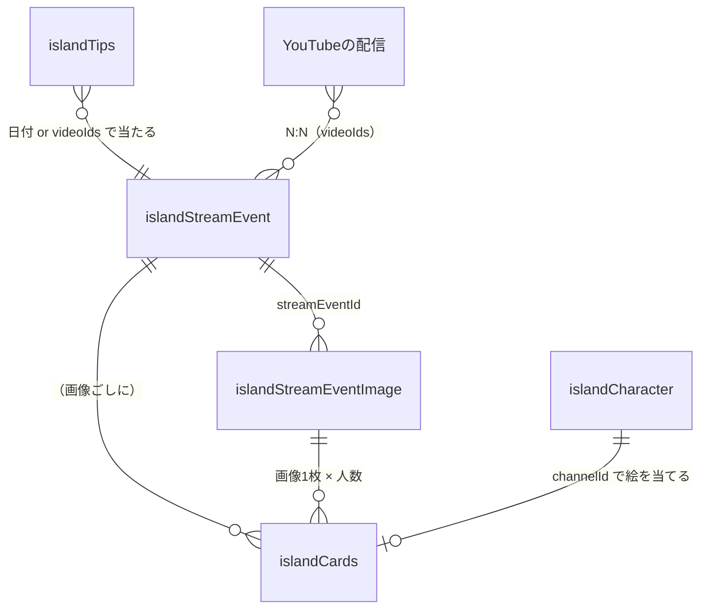

# あやと島カード — いまの仕様と、直しかたの提案

**これは決める前の資料で、仕様書ではない。** 決まったら
[`island-cards.md`](./island-cards.md)（仕様の正本）と
[`island-db.md`](./island-db.md)（データ設計）へ畳んで、ここは記録として残す。

| | |
| --- | --- |
| 書いた日 | 2026-10-01 |
| きっかけ | あやと「機能追加したあやと島カードにキャラクターがリンクしてないのはなぜですか」「配信日から3日くらい経ってて、画像アップ日から1日経ってる」 |
| 決めてほしい人 | あやと |
| 事実の棚卸し | [`island-card-data.md`](./island-card-data.md)（別紙） |

---

## 0. 要点（ここだけ読めば判断できる）

**あやとの見立てが当たっている。**

> あやとじまカードは日付に紐づくから、その日付にある企画にも紐づくっていう話で、
> 別に企画がなければどの企画にも紐づかないっていうふうな感じでいいと思うんですよね。
> 多分そういうふうに設計したような記憶があるけど（2026-10-01）

**そう設計されていた。そして、そう実装されていない。**

| | 思想（`island-cards.md`） | 実装（いま動いているもの） |
| --- | --- | --- |
| カードの軸 | **日付**。企画はその日に付くラベル | **企画**。企画が無いとカードが1枚も作られない |
| 企画の無い日 | 写真は貼れる（画面にもそう書いてある） | 写真は貼れる。**カードは永久に0枚** |
| 0枚になったとき | — | **どこにも出ない。** ログに `warn` が1行出るだけ |

**実害**: カードは **2026-09-20 で止まっている。9/21 以降は0枚。**
9/27 の写真（「バイバイスウェーデン」）にキャラクターが1人も乗っていないのは、
これが理由。**11日間、誰も気づいていなかった**（毎晩のジョブは毎日成功している。
「あるべき617枚／新しく作る0枚」と出して、**緑のまま**）。

棚卸しでは、資料と実装の食い違いが**ほかに11件**出ている（[別紙](./island-card-data.md) 6章）。
この資料で決めるのはそのうち1件（カードの軸）で、残りは別に片づける。

**提案**: カードの軸を**企画から日付へ戻す**（案C）。
元の思想に戻す向きの変更で、いまの仕様で守られているものを1つも壊さない。

---

## 1. いまの仕様

### 1.1 思想（`island-cards.md` より、そのまま）

> **その日の配信で投げ銭してくれた人が、その日の写真をもらう。**
> 写真の上に、その人のキャラクターが1体立っている。それだけ。
> 順位でも点数でも称号でもなく、**その日そこにいたという事実だけ**が残る

守られている約束は3つ。**どの案を採っても、これは動かさない。**

1. **候補に出す人を広げない。** 写真に入れられるのは、**その日に投げ銭して
   くれた人だけ**。2026-09-14 にここを広げて9時間13分本番に出した事故がある
   （`island-incident-2026-09-14-cards.md`）
2. **誰でも読める応答は、誰かを指す値を持たない**（2026-09-15 から）。
   名前は「名乗りでも身元が分かった人」だけに出す。
   **`channelId` で絵が当たるようになっても、名前の出る人は1人も増やさない**
3. **置き方（`x/y/rot/scale`）に触らない。** 触ると本人が動かしたカードが戻る

### 1.2 データ



| 入れ物 | 何か | 鍵 | 誰が書くか |
| --- | --- | --- | --- |
| `islandStreamEvent` | 企画 | 手で決めた id（`nordic-day-9` など） | **`python/stream_events_seed.json`（手書き・14行）** |
| `islandStreamEventImage` | 企画に付く画像 | 自動 | あやとが `/me` から貼る |
| `islandTips` | 投げ銭の台帳 | スパチャの item id ほか | アラートボックス／毎晩の BigQuery／手入力 |
| `islandCards` | 配られたカード | `<画像ID>__<チャンネルID>` | `mintForImage`（貼った瞬間）／`island_cards.py`（毎日） |

Git 側にも表がある。**ここが今回の分かれ道になっている。**

| Git の表 | 何か | 誰が読むか |
| --- | --- | --- |
| `content/plans.ts` | 企画（祭り・節目） | 画面 |
| `content/nordic.ts` の `DAYS` | 北欧の旅程 **16日ぶん** | 画面 |
| `content/planDays.ts` | 日付 → その日の企画名 | **カードの見出し** |

### 1.3 カードが1枚できるまで

```
写真を貼る
  ↓  その日の企画を Firestore から引く（eventsOnDay）
  ↓  企画が1本 → それに付ける ／ 2本以上 → あやとが選ぶ
  ↓  0本 → streamEventId は空のまま。warn を1行出して進む     ← ここ
  ↓
mintForImage(画像)
  ↓  if (streamEventId) ……空なら、そもそも呼ばれない          ← ここ
  ↓  EVENTS.doc(streamEventId) が無ければ return 0枚           ← ここ
  ↓
その企画に当たる投げ銭を集める（日付が同じ or videoIds が一致）
  ↓
1人1枚のカードを置く
```

**黙って0枚になる分岐が3つあり、3つとも画面に何も出さない。**

---

## 2. 今回のバグ

### 2.1 何が起きたか（実測・2026-10-01）

| | |
| --- | --- |
| カードの総数 | **617枚**（公開の口は600枚で切る。§2.4） |
| カードがある日 | **9/13 〜 9/20 の8日ぶんだけ** |
| 9/21 以降 | **0枚**（9/27 の写真も0） |
| `islandStreamEvent` | **16件**（うち2件は archived。口に出るのは14）。いちばん新しいのが `nordic-day-9`（9/20） |
| Git の旅程表（`nordic.ts` の `DAYS`） | **17行**（出発＋1〜16日目） |
| 企画に紐付いていない写真 | **27枚**（9/21〜9/30）。写真96枚に対し、企画に付いた画像は69枚 |

### 2.2 なぜ止まったか

企画の出どころは **`python/stream_events_seed.json` という手書きの表で、14行**。
旅に出る前に書いたもので、**9日目で尽きている。**

一方、画面に出る「北欧旅 16日目」は **Git の旅程表**から引いている。

> **表示は Git を読み、カード作りは Firestore を読んでいる。**
> 9/21 以降、この2つは食い違ったままだった。

`content/planDays.ts` のコメントはこう書いている——
「#202 で『北欧◯日目』も企画になった（`islandStreamEvent` に**1日1件ある**）」。
**この前提が、9/21 から成り立っていない。**

### 2.3 なぜ誰も気づけなかったか

- 写真は**貼れる**。エラーも警告も出ない
- 画面には企画名（Git 由来）が**出る**ので、結びついているように見える
- カードが0枚でも、`/me` は「まだ無い」としか言わない。
  **「0枚」と「作られなかった」が同じ顔をしている**（`island-standards.md` 10 と同じ形）
- 見張りが1本も無い

**あやとが写真を見て気づくまで、11日間だれも知らなかった。**

### 2.4 棚卸しで出た、別の2件（この決定とは独立。別に片づける）

**(a) 公開の口が 600 枚で切っていて、超えたぶんは古い日から静かに消える。**

`cards.ts` の `MAX_CARDS = 600`。**いま 617 枚なので、17枚がもう取れていない。**
`limit` を渡しても読まれない。上限はどの資料にも書かれていない。

消えるのは**いちばん最初にカードをもらった人たち**（9/06・9/11・9/12）で、
`/cards` も `/friends` も `/about` も同じ口を読むので**同時に消える。**
枚数が増えるほど、過去が端から欠けていく。

**(b) 「この投げ銭はどの企画のものか」が、3か所に別々に書いてある。**

| どこ | 規則 |
| --- | --- |
| `functions` の `eventsForTip` | 日付 or `videoIds` |
| `python` の `events_for_tip` | 日付 or `videoIds` ＋ **`videoStartedAt` で日を補正** |
| `channelsOfDay`（写真の口） | **日付だけ** |

**3つとも違う。** そして本番の数字に出ている——
**9/17 は「その日の人7」に対して「カードを持っている人8」**、9/14 は 8 と 9。
どれが正しいかを決めている場所が、コードにも資料にも無い。

`defaultPlace`（置き方の式）は「2か所に書くとずれる」と強く注意されているのに、
**より重い「当て方」の規則のほうが野放しになっている。**

---

## 3. 設計のどこに穴があったか

**「企画の無い日」は想定されていた。想定されていなかったのはその先。**

`PhotoPost.tsx` にこう書いてある:

> | その日の企画 | 画面 |
> | 0本 | そう出す。**貼れなくはしない**（企画の無い日の写真もある） |

画面もそう言う——「この日に立っている企画はありません。写真はこのまま貼れます。」

**ここまでは正しい。** 抜けていたのは次の1行:

> **企画の無い日に貼った写真は、カードが1枚も作られない。**

`island-cards.md` にも `island-db.md` にも、この帰結はどこにも書かれていない。
**仕様の漏れ**であって、実装のバグではない。あやとの読みのとおり。

根っこは1つ:

> **「写真は日付に付く」と思って画面を作り、「カードは企画に付く」と思って
> 裏側を作った。** 2つの思い込みは、企画が毎日ある間だけ一致していた。

---

## 4. 直しかたの選択肢

### 案A — 企画の表を埋め続ける（いまの形のまま）

9/21〜9/27 の7件を足し、これから毎日足す。

| | |
| --- | --- |
| 良い | いまの作りを1行も変えない。すぐ直る |
| 悪い | **同じ穴がまた開く。** 表が尽きるたび、また誰も気づかない |
| アルバニア | **埋められない。** 旅程が1行も無い（どこを回るか本人も未定） |

**採らない。** 今日ずっと直してきた「手で書いた表が日に追い越される」と同じ形。

### 案B — 企画が無ければ、その場で「その日の企画」を自動で作る

写真を貼った日に企画が無ければ、`day-2026-09-27` のような企画を勝手に立てる。

| | |
| --- | --- |
| 良い | 穴は原理的に塞がる。いまの「カード＝企画×画像×台帳」を変えない |
| 悪い | **企画の一覧が、企画でないもので膨らむ。** 「企画」は祭りや節目を指す言葉で、「ただの9月27日」はそれではない |
| 波及 | `/next`・掲示板・月末配信の集計が、ぜんぶこの偽の企画を数えるようになる |

**採らない。** 入れ物の意味を薄めて穴を塞ぐのは、あとで必ず別の形で出てくる。

### 案C — カードの軸を、企画から日付へ戻す 【**推奨**】

```
いま:  カード = 画像 × （その画像の"企画"に当たる投げ銭）
提案:  カード = 画像 × （その画像の"日"に当たる投げ銭）
```

企画は **「この写真はこの企画のもの」というラベル**に降格する。
付いていれば見出しに出る。付いていなくてもカードは配られる。

| | |
| --- | --- |
| 良い | **企画の有無と、カードが配られるかが、切り離される。** 旅程の無いアルバニアでも、何も足さずに動く |
| 良い | あやとの言葉（「企画がなければどの企画にも紐づかない、でいい」）そのまま |
| 良い | 入れ物を1つも増やさない。企画の意味も薄めない |
| 良い | **§2.4(b) の3つ巴が1つに畳める。** 軸が「画像の日」1本になるので、`eventsForTip` / `events_for_tip` / `channelsOfDay` が同じ答えを返す。いまの食い違い（9/17 の 7 対 8）も消える |
| 悪い | 0時またぎの補正（`videoIds`）が、いまは企画にぶら下がっている。**画像の側に移す必要がある** |

---

## 5. 案Cが、元の思想を壊さないか

**ここがいちばん大事なところなので、1つずつ当てる。**

| 元の思想 | 案Cでどうなるか |
| --- | --- |
| 「その日そこにいたという事実だけが残る」 | **強まる。** 企画が無い日も「その日いた」が残る |
| **候補に出す人を広げない**（その日の投げ銭の人だけ） | **変わらない。** むしろ判定が「その日」1本になって単純になる |
| 誰でも読める応答は誰かを指す値を持たない | **変わらない。** 名前の出しかたに1文字も触らない |
| **企画と配信は N:N**（9/11 は3本が同じ配信に乗る） | **保たれる。** 9/11 に企画ごとの画像が3枚あれば、3枚ともカードになる。いまと同じ |
| 配信日の境目は日本時間の0時 | **要対応。** いまは「企画の `videoIds`」で補正している。これを**画像の `videoIds`** へ移す（下の §6） |
| 2か所から作る。どちらが先でも同じ結果 | **変わらない。** 鍵（`<画像ID>__<チャンネルID>`）を変えないので、二重に作られない |
| 置き方に触らない | **変わらない** |

**壊れるものは見つからなかった。** 唯一の宿題は0時またぎの補正の置き場で、
これは**いまより素直になる**——「この写真はこの配信のもの」は、企画ではなく
写真について言いたいことだから。

---

## 6. 案Cでやること（決まったあと）

1. `mintForImage` / `island_cards.py` が、**画像の `day`** で投げ銭を集めるようにする
2. 0時またぎの `videoIds` を、企画から**画像**へ移す（既存のぶんは企画から引き継ぐ）
3. `streamEventId` を**任意**にする。空でもカードを作る
4. **9/21 以降のぶんを焼き直す**（既存のカードは `x/y/rot/scale` に触らない）
5. **見張りを1本足す** — 「写真はあるのにカードが0枚の日」を数えて赤くする。
   これが無いと、形を変えても次は別の理由で黙って止まる
6. `island-cards.md` と `island-db.md` を書き換える

**§2.4 の2件は、この決定を待たずに別で出す。**
(a) の600枚は**いま17枚が取れていない**ので急ぐ。(b) は案Cを入れると
ひとりでに1本になるので、案Cの中で片づける。

---

## 7. 決まったこと（2026-10-01・あやと）

| | 決まり |
| --- | --- |
| **案C** | **採る。** カードの軸を企画から日付へ戻す |
| 企画の無い日の見出し | **問いが間違っていた**（下） |
| 9/21〜9/26 を企画として立てるか | **立てない** |

### 問い2は、こちらの立て方が間違っていた

あやと:

> 見出しって何？写真アップする時に書いてない？

**そのとおり。** 一言（`note`）は**写真を上げるときにあやとが書いている**
（`PhotoPost.tsx` の `note`）。9/27 の「バイバイスウェーデン」がそれ。
カードの足元に出るのは3つで、**書く人がいないのは企画の札だけ**だった。

| 足元に出るもの | 出どころ |
| --- | --- |
| 日付 | カードが持っている |
| 一言 | **あやとが上げるときに書く** |
| 企画の札（リンク） | 企画。**無い日がある** |

だから選ぶものは無い。**企画が無ければ、その行を出さない。** それだけ。
「無いものを埋めない」の、いつもの決まり（`island-standards.md`）。

**こちらは「見出し」という言葉で、書く人のいる字と無い字を一緒くたにしていた。**
選択肢を3つ並べる前に、画面に何が出ているかを数えればよかった。

---

## 8. 元の「決めてほしいこと」（記録）

### 決めてほしい1 — 案Cでいいか

元の思想に戻す向きだと読んでいるが、**「企画が軸」をわざと選んだ理由**が
当時あったなら、それはこちらの資料に残っていない。覚えていたら教えてほしい。

### 決めてほしい2 — 企画の無い日のカード、見出しに何と出すか

いまは企画名が見出しに出る（「北欧旅 16日目」）。企画が無い日は何を出すか。

| 案 | 見出し |
| --- | --- |
| C-1 | 日付だけ（「9月27日(日)」）。**いちばん静か** |
| C-2 | 章の名前（「アルバニアの旅」） |
| C-3 | その日の配信の題 |

**こちらの推しは C-1。** 無いものを埋めないほうが、島の決まりに合う。

### 決めてほしい3 — 9/21〜9/26 の6日ぶん

ストックホルム滞在で「動かない日」が続いた6日。写真が貼ってあれば
案Cでは自動でカードになるが、**企画としては立てなくていいか**（立てないと
見出しは C-1 の日付だけになる）。

---

## 付録 — この資料の読みかた

- 事実の棚卸し（件数・列・誰が書くか）は [`island-card-data.md`](./island-card-data.md)
- 仕様の正本は [`island-cards.md`](./island-cards.md)。**決まるまで、あちらは直さない**
- 2026-09-14 の事故は [`island-incident-2026-09-14-cards.md`](./island-incident-2026-09-14-cards.md)
