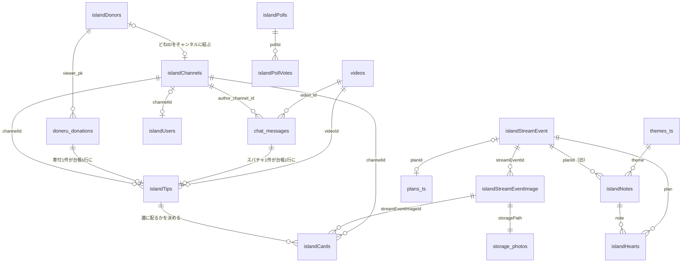
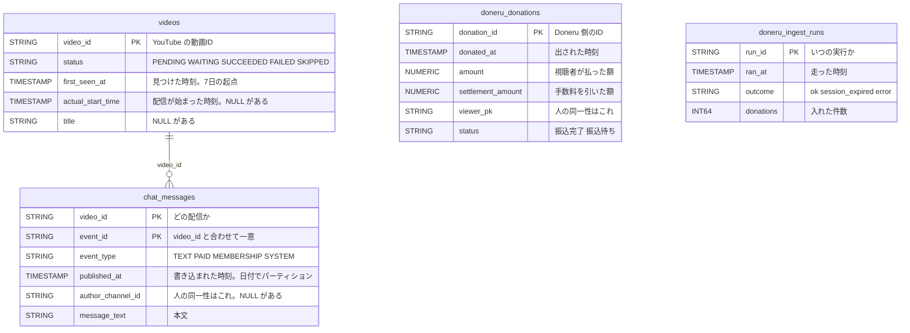
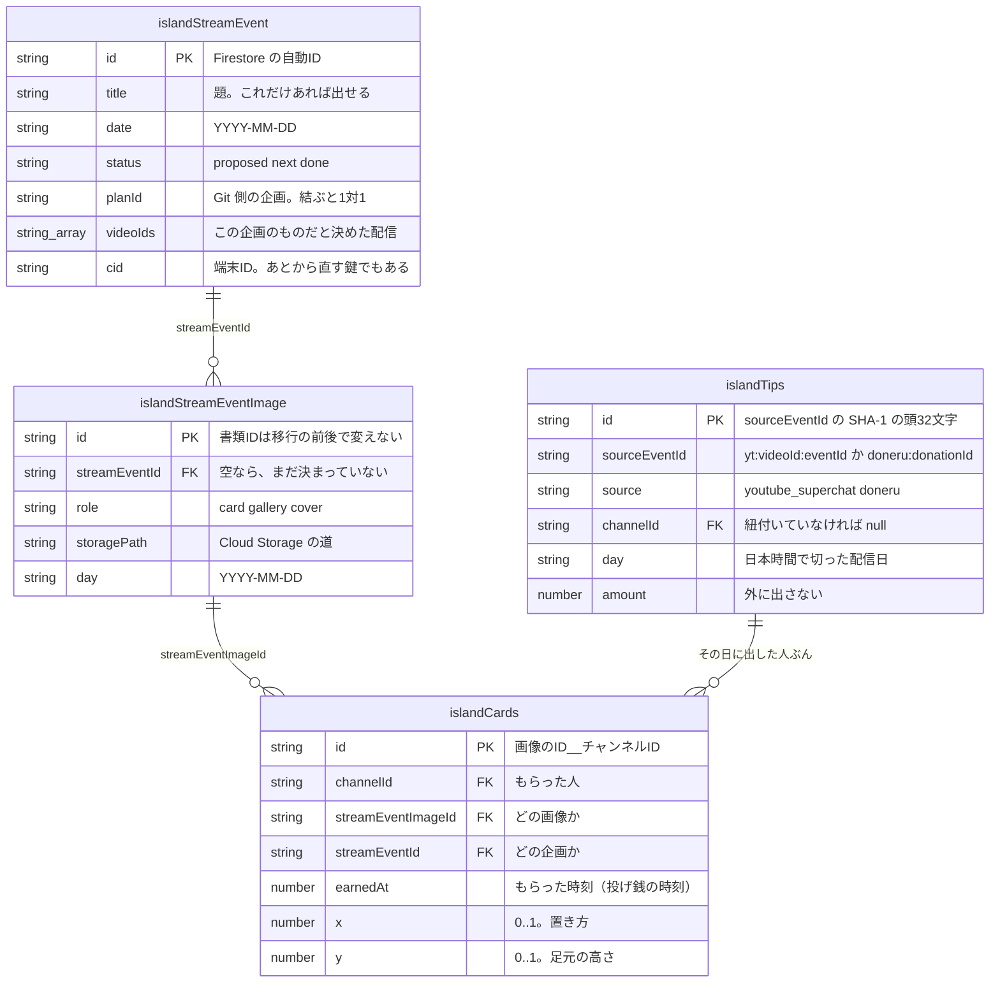

# あやと島 — データ設計

**この文書は「いま、本番がどうなっているか」だけを書く。**
なぜそう決めたか・何に躓いたかは [`island-db-notes.md`](./island-db-notes.md)、
口（API）の一覧は [`island-api.md`](./island-api.md) にある。

置き場は4つ。**BigQuery**（配信とコメントの原本）、**Firestore**（島の状態と、
みんなが書いたもの）、**Git**（人が書いたコンテンツと、機械が焼いたもの）、
**Cloud Storage**（旅の写真の実体）。

読む順は上から。急ぐなら **1章の絵**と **3章の表**だけで全体像になる。

---

## 1. 全体像

### 1.1 島ぜんぶ（粗く）



読み方: **左が「1」、右が「多」。** 名前で置き場が分かる。
**`snake_case` は BigQuery**（`videos` `chat_messages` `doneru_donations`）、
**`islandXxx` は Firestore**、`plans_ts` `themes_ts` は Git
（`site/content/plans.ts` / `themes.ts`）、`storage_photos` は Cloud Storage。

**カードは、写真と投げ銭の掛け算でできる。** 1枚の写真に対して、その企画の日に
投げ銭した人ぶんカードができる。だから `islandCards` に矢印が2本入っている。

### 1.2 配信とコメント（BigQuery）



`doneru_donations` と `doneru_ingest_runs` は**互いに親子ではない。**
片方は寄付、もう片方は「取りに行った記録」で、寄付が0件の実行も残る。

### 1.3 企画・写真・カード



**企画と配信は N:N。** 1本の配信に企画が何本も乗る（9月11日は「北欧旅の出発日」
「海外出発二周年」「ジョージアバイバイ」の3本）。だから
「`videoId` → その配信の企画」を**1本に決めない。**

当たり方は2つあって、**両方を足す**（片方で打ち切らない）。

1. その企画が `videoIds` でこの配信を名乗っている
2. 企画の日付と、投げ銭の日（日本時間）が同じ

**1で当たったら2を見ない、にしない。** あやとが `videoIds` を足すのは
たいてい1本だけなので、そこで打ち切ると残りのカードが黙って消える。

---

## 2. 用語 — 読み違えると事故になるもの

### 2.1 人を指すもの が4つある

| 名前 | 何 | どこで使う | 混ぜるとどうなるか |
| --- | --- | --- | --- |
| `channelId` / `author_channel_id` | YouTube のチャンネルID（`UC…`） | `chat_messages` `islandChannels` `islandTips` `islandCards` | **人の同一性はこれ。** 表示名で数えると同じ人が増える |
| `uid` | Firebase のログインID | `islandUsers` `islandHere` `islandHearts` | ログインした人にしか無い |
| `cid` | 端末ID（`crypto.randomUUID()`・36文字） | `islandStreamEvent` `islandNotes` `islandRate` `islandHearts` | **企画では「あとから直す鍵」。** 画面に返してはいけない |
| `viewer_pk` / `viewerPk` | どねID（Doneru の中の人の識別子） | `doneru_donations` `islandDonors` `islandTips` | Doneru 側でしか通じない。`islandDonors` で `channelId` に結ぶ |

**`cid` には強さが2段ある。** 鍵として使うときは長さで縛る（`isStrongCid`）。
8文字でも通る `isCid` は連投を数えるためのもので、**そのままでは鍵に使わない。**

### 2.2 `video_id` と `videoId` は同じものだが、綴りが場所で違う

| 綴り | どこ |
| --- | --- |
| `video_id` | BigQuery の全部。**`island/state.stats.latest[]` も**（BigQuery の struct をそのまま焼いているため） |
| `videoId` | Firestore の `islandTips` `streamChatMessages` `streamChatRuns`、`islandStreamEvent.videoIds[]` |

`stats.latest[]` を `videoId` で読むと `undefined` になる。
（`site/lib/api.ts` の `IslandStats` に、この経緯ごと注記がある）

### 2.3 「1日」の切り方が3つある

| 切り方 | 境目 | どこで |
| --- | --- | --- |
| **日本時間の0時** | JST 00:00 | 投げ銭の「配信日」（`islandTips.day` / カード / `islandChannels.days` / `island/state.stats`） |
| **UTC**（＝JST 朝9時） | JST 09:00 | 出席の数え方（`python/build_residents.py`）と、口の1日の上限（`islandRate`・`today()`） |
| **配信の一晩** | 人が決める | 0時をまたいだぶんは `islandStreamEvent.videoIds` に後半の動画IDを足す |

**UTC で切るのは、22時開始の枠と0時をまたいだ続きを1日にまとめるため。**
JST で切ると夜中に1日が割れて、連投制限も訪問者数も半分になる。
**JST 0時で切るのは、投げ銭を「その日の配信のもの」として人が読むため。**
どちらも正しく、**用途が違う。混ぜない。**

### 2.4 `photo` と キャラクター は別物

| | 何 | どこが正 |
| --- | --- | --- |
| キャラクター | カードや島に乗る絵（ひめひめさんのハリネズミ） | **Firestore の `islandCharacter`**（元はあやとのスプレッドシート。`site/content/residents.ts` に焼いてある） |
| プロフィール写真 | YouTube のアイコン | `islandChannels.photo` / `islandUsers.photo` |

キャラクターの割り当てはあやとが決めたもので、**YouTube を更新しても
変わらないのが正しい。** `photo` はマイページのアイコンが古くならないようにするもの。
**本人にキャラクターを選ばせる口は無い**（他人の絵を自分のものにできてしまう）。

#### 誰の絵かは、`channelId` で引く（#429 の A・2026-09-16）

**引く順は1つに決まっている。** 引くところは `functions/src/cards.ts` の
`pickIcon`（カードと `/nordic/photos`）と `python/build_residents.py` の
`link`（島を歩く人）で、**どちらも同じ順**。

| 順 | 何で引くか | 誰に効くか |
| --- | --- | --- |
| 1 | `islandCharacter.channelId` ＝ カードの `channelId` | 102人中 **84人**（2026-09-17。`character_days_probe`。かぶり0件） |
| 2 | `islandCards.nameSnapshot`（投げたときの名乗り）→ `islandCharacter.lookupKeys` | 1で当たらなかった人の**受け皿** |

**名乗りを先に見ない。** 名前は変わるが `channelId` は変わらないので、
名乗りを先に見ると**本人が YouTube や Doneru で打った字で絵が決まる**——
「選ばせる口は無い」と書いてあるその口が、そこに開く。実際、名前を変えた日と
Doneru の表示名にタイポがあった日に、カードから絵が消えていた。

**同じ `channelId` が2人のキャラクターに付いていたら、どちらも当てない。**
名乗りへも落とさない（落とすと、結局2人のうち片方の絵が乗る）。
`lookupKeys` の鍵が2人に付いているときと同じ決め方。

#### 名乗りで引くほうは、**YouTube の「しっぽ」**で外れる（#135・2026-09-17）

図鑑の `channelName` は**ハンドル**（`@…`）で入っていて、引き当ては
**完全一致**（`islandCharacter.ts` の `findBy`、`cards.ts` の `iconsOf`、
`app/alertbox/matching.utils.ts`）。ところが**人が打つのはハンドルの
人の部分だけ**で、YouTube が付けたしっぽ（`-r9z` `1234`）までは打たない。

**打っても当たらない。** 当たらないと、配信の画面に絵が出ないし、
カードにも乗らない。

しっぽの形は BigQuery の `chat_messages.author_name`（**ぜんぶハンドル。
2,335通り**）を数えて決めた。落とすのは**この3つだけ**で、規則は
`python/name_tail.py` にある。

| 形 | 2,335通り中 | 何か |
| --- | --- | --- |
| `-` ＋ 3字（英小文字と数字が**両方**混じる） | 638 | YouTube が付けた |
| `-` ＋ 5字（同上） | 132 | YouTube が付けた |
| 数字ちょうど4桁（西暦に見えるものを除く） | 301 | YouTube が付けた |
| `-` ＋ **英字だけ**（`-chan` のような呼び方） | 14 | **本人の字。落とさない** |

**落としたあとが4字未満のものは作らない。** 実測で、しっぽ付き 1,069件の
うち 285件がそうなる（151件は2字未満）。「あお」のような字は別の誰かの
名乗りと普通にかぶるので、**引ける字を増やしたぶんだけ人違いが増える。**

落とした形を足すのは `python/admin/tail_alias.py`（既定は下見）。
**足すのは `aliases` だけで、`channelKeys` には触らない**——あちらは
スパチャの取り違えを減らすためにわざと狭くしてある。
口が `lookupKeys` を焼き直し、OBS は生の `aliases` を見るので、
**同じ1回で口と配信の両方が直る。**

#### ドネルが送ってくるのは、しっぽを落とした形ではなく**チャンネル名**（#147・2026-09-18）

上のしっぽ落とし（`tail_alias.py`）では当たらない人がいた。
**ドネルは投げ銭の名乗りに、その人の「表示名」を初期値として入れてくる。**
ハンドルでもなければ、ハンドルからしっぽを落とした形でもない。

    ドネル → findBy("lookupKeys", …)      array-contains ＝ **完全一致**
    normKey は空白を残す（/\s+/g → " "）  「◯◯ v」≠「◯◯v」

空白を無視する突き合わせは **OBS（`app/alertbox/matching.utils.ts`）にしか無い。**
だから**チャンネル名そのもの**を `aliases` に足す（`python/admin/channel_alias.py`）。
図鑑の `channelId` から YouTube を引いて字を取る——**鍵は使わない。**
名乗らない側から feed（668バイト）を引き、駄目なときだけ頁（807KB）へ落ちる。

足すのは `aliases` だけで、`channelKeys` には触らない。
**ぶつかったら、どちらにも足さない**（足した鍵が他の人のもの／2人が同じ字に
なる／ハンドルと同じ字）。`normKey` は広げない——広げると全員の鍵が変わって、
取り違えが増える。

**これは毎晩ひとりでに走る。** `.github/workflows/channel_alias_nightly.yml`
（`Fetch Doneru Donations` の完了に繋いである。cron `45 1 * * *` は保険）。
1回押して終わりにすると、**図鑑に新しく入る人**（`channelName` はハンドル）と
**チャンネル名を変えた人**が、翌日からドネルで引けなくなる。
しかも**赤くならない**——配信の画面にその人の絵が出ないだけ。

繋ぎとその既定（毎晩ぶんは下見にしない）を見張るのは
`python/channel_alias_nightly_selftest.py`。**繋ぎ先のワークフロー名は
字で突き合わせている**ので、あちらの `name:` を変えると PR の時点で赤くなる。

**足したあとは、同じ run の中で `python/admin/name_clash.py` が数える。**
上のぶつかり検査は `normKey`（空白も記号も**残す**）だけで、配信に映る OBS は
Collator に落ちて**空白・記号・かな・濁点・小書きかな**まで潰す。つまり
**`normKey` では別物、OBS では同じ字**という呼び名を、毎晩の仕組みが
いつか足しえる——そうなると**投げ銭した人と違う人の絵が配信に出る。**
終了コード **1（見つかった）も 2（数えられていない）も赤**にしてある。
誰も見ていない時間に走るので、赤以外に気づく道が無い。
**下見（`dry_run: true`）の回でも回る**（1バイトも書かない回でも、
いまの図鑑がぶつかっているかは知りたい）。

毎晩ぶんは `{"attribute": false}` で回している。**今日ぶんの切り分けは
YouTube を100人ぶん引き直す**ので、すぐ前の `channel_alias` に続けてもう1周すると
締め出し（`BLIND`）が増える。切り分けまで見たいときは `run_admin_script` から
`name_clash` を `{}` で押す。

**名前を出す条件は、これとは別。** 絵が乗っても名前は出ない。
名前が出るのは「**投げたときの名乗りで身元が分かって**、かつ本人が島に名前を
出してよいと言った」ときだけで、そこは `channelId` で引くようになっても
1人も増えていない。

> **`channelId` で引くと、Doneru に別名で投げた人の絵も公開の面に出る。**
> どねID がチャンネルに結んである人は、別名で投げても `channelId` が入るため。
> 2026-09-15 の「みんなが見える場所では匿名性を守りたい」を受けて絵を名乗り
> だけで決めていたのが前の版で、#429 の A はそれを「絵は動かないほうがよい」で
> 上書きしている。**同じ1つの欄の裏表で、両方は立たない。**

#### 新しく作る人には、**作った瞬間に入る**（#155・2026-09-18）

上の毎晩の繋ぎは「あとで追いつく」であって「作ったら入る」ではない。
**画面から作った人は、その日のあいだドネルから引けない。**
しかも繋ぎは `channelId` から引くので、**画面から作ると `channelId` が
入らない**（本番で103人中19人が空。#441）人は、翌日になっても対象に
入らない——**永久に入らない。** 穴は2段だった。

だから口（`POST /island-api/characters/{id}`）が、**書く前に引く。**

| 打たれた字 | どこを引くか | 何が入るか |
| --- | --- | --- |
| ハンドル（`@…`） | `https://www.youtube.com/@…` の頁 | `og:title` → `aliases` ／ `rel="canonical"` → `channelId` |
| チャンネルID（`UC…`） | `feeds/videos.xml?channel_id=…`（668バイト） | `<title>` → `aliases` ／ 打たれた字 → `channelId` |
| ふつうの表示名 | **引かない**（もう入っている） | — |

決めごとは `channel_alias.py` と同じで、**足すのは `aliases` だけ。
`channelKeys` には触らない。** `channelId` は**空のときだけ**入れ、
すでに入っている書類にも、**すでに誰かに付いているIDにも触らない**
（`characters_link.py` と同じ。同じIDが2人に付くと、カードの絵が入れ替わる）。

**引けなくても、作成は通す。** 人が作れなくなるほうが困る。ただし
黙って通さない——返事に理由が入り、画面に「表示名は入れられませんでした」
が出る（`docs/island-api.md` の `named`）。

ハンドルの頁は本番で 1.69MB あるが、表示名もIDも **757KB 目まで**に
居るので、**そろったところで受け取りをやめる**（実測 350ms）。
`channelTitleFor`（どの `channelName` で引けたか）を書類に残して、
同じ字で2度引かない——画面は絵を1枚ずつ送ってくるので、1回の保存で
口を2回も3回も叩く。**引けなかった回は印を付けない**ので、次の保存で
引き直す。

見張りは `functions/selftest/character_alias_selftest.mjs`。偽の引き先を
立てて、**本物の `fetch` と本物の拾い方**を通す。足を9通りに壊して、
そのたび赤くなるところまで見ている。

---

## 3. 責務 — 何が正で、誰が書いて、誰が読むか

**置き場（BigQuery / Firestore / Git）は「どこにあるか」の話で、責務の話ではない。**
責務はこの表で見る。

### 3.1 正本（ここが壊れたら作り直せない）

| データ | 正はどこか | 書く人／仕組み | 読む先 | 消えたらどうなるか |
| --- | --- | --- | --- | --- |
| 配信の一覧と取り込み状態 | BigQuery `videos` | `python/discover_videos.py`（毎晩） | 取り込み・全部の集計 | YouTube から引き直せる。**取り込み履歴だけ失う** |
| コメント | BigQuery `chat_messages` | `python/fetch_chat_data.py`（毎晩） | 島の数字・住人・切り抜き・月末表彰 | **アーカイブが消えていれば戻らない** |
| Doneru の寄付 | BigQuery `doneru_donations` | `python/fetch_doneru_donations.py`（毎晩） | 投げ銭台帳・足代 | Doneru に残っていれば1回流せば戻る |
| 旅の写真の実体 | Cloud Storage | あやと（写真を貼る口から） | 企画のページ・カード | **戻らない。** 手元にしか原本が無い |
| 人が書いた企画・付箋 | Firestore `islandStreamEvent` `islandNotes` | 視聴者さん（口経由） | 掲示板・国のページ | **戻らない。** 人の字 |
| 島の見え方の設定 | Firestore `islandUsers` | 本人（島での見え方を保存する口） | 島の状態が返す `residents` | 本人が入れ直せる |
| どねID とチャンネルの対応 | Firestore `islandDonors` | 毎朝の種＋あやとが手で結ぶ | 投げ銭台帳の `channelId` | **手で結んだぶんは戻らない** |
| 手で書くコンテンツ | Git `site/content/*.ts` | 人（レビューあり） | 島の全ページ | Git に履歴がある |
| いまいる場所・今週 | Firestore `island/state.current` | あやと（口から、または `island_set_current.py`） | 島の看板 | 入れ直せる |

### 3.2 写し（正から作り直せる。壊れても焼き直せばよい）

| データ | 写し先 | 元 | 作り直すもの |
| --- | --- | --- | --- |
| 島の数字 | Firestore `island/state.stats` `island/state.fund` | BigQuery | `python/island_daily_stats.py` |
| 投げ銭台帳 | Firestore `islandTips` | BigQuery（スパチャ＋Doneru） | `python/island_tips.py` |
| カード | Firestore `islandCards` | 写真 × 台帳 | `python/island_cards.py` / `functions/src/streamEvents.ts` |
| チャンネル名・日数 | Firestore `islandChannels`（`name` `lastAt` `days`） | BigQuery | `python/island_channels.py` |
| チャンネル写真 | Firestore `islandChannels.photo` | YouTube API | `python/island_channel_photos.py` |
| 焼き込み | Git `site/content/*`（自動生成ぶん） | BigQuery ほか | `.github/workflows/rebake.yml`（5.2） |
| 旧・北欧の写真 | Firestore `nordicPhotos` | `islandStreamEventImage` | 書く口が両方に書いている |

### 3.3 同じ事実が2か所にあるもの — **どちらが正か**

| 事実 | 正 | 写し | 食い違ったら |
| --- | --- | --- | --- |
| 住人（誰が島にいるか） | `islandUsers` ＋ `islandChannels`（本番） | `site/content/residents.ts`（焼き込み） | **本番が正。** 焼き込みは、島の状態の口が読めなかったときの受け皿 |
| 常連の数 | `island/state.stats.activeFriends` | `residents.ts` の `ACTIVE_FRIENDS` | **本番が正**（画面に出るのはこちら） |
| 企画 | `islandStreamEvent`（掲示板に出るほう） | `site/content/plans.ts` / `legends.ts` の `PLANS` `LEGENDS` | `planId` で結ぶ。**Git 側1つに結ぶ行は1つだけ**（409 で断る） |
| 企画に付く写真 | `islandStreamEventImage` | `nordicPhotos`（旧） | **新が正。** 書く口が両方に書いている。書類IDは同じ |
| 「その日いた人」 | `islandTips`（台帳） | `nordicDays`（旧・6件残っている） | **台帳が正。** `nordicDays` はもう読んでいない |
| キャラクターの割り当て | Firestore `islandCharacter` | `site/content/residents.ts` | **本番が正**（2026-09-16 に確かめ直した。前の版は「あやとのスプレッドシート」と書いていたが、Viewers 表はもう誰も読んでいない。`build_residents.py` は図鑑を読む）。焼き直しで反映する。**誰のものかは 3.4** |
| 「このカードは誰の絵か」 | `islandCharacter.channelId` | `islandCards.nameSnapshot` で引く受け皿 | **`channelId` が正**（2.4）。持っていない人だけ名乗りに落ちる |
| 豚の貯金箱の元（鍵・起点・スパチャ・目標） | GAS の `Goals` 表 | Firestore `islandGoal/2025-10-24` | **GAS が正**（#305）。スパチャを書き足す OBS の書き先がそこしかなく、**額が伸びるのは表の側だけ**だから。サイトは GAS → 無ければ Firestore の順に読む。控えは `goal_migrate` で作る。**表を消した瞬間から控えが正になる。** 順を入れ替えてよくなるのは、`SuperChats` の書き込み先を移したあと |
| 誰かのアイコン | YouTube | `islandChannels.photo` / `islandUsers.photo` | YouTube が正。1日500人ずつ追いかける |

### 3.4 キャラクターは誰のものか — **結ぶ材料がどこにあるか**

**正は `islandCharacter.channelId`。** 人の同一性はチャンネルID（2.1）なので、
ここが入っていない人は**名前でしか引けず、相手が改名した翌日に消える。**
2026-09-16 の実測で、102人中 **24人が空**。そのうち機械で決まる6人は
`characters_link` が埋めたので、**2026-09-17 の実測では 18人**
（`python/admin/character_days_probe.py`。かぶりは0件で、
焼き込みの `residents.ts` が結んでいる84人と1件の食い違いもない）。

**作った時点の対応は、どこにも残っていなかった。** 図鑑の元になった
Viewers 表の列は `name` / `Emoji` / `Icon` / `videoUrl` の4つで、
**チャンネルIDの列が無い**（`docs/island-character.md` 1章）。
移行（`characters_migrate`）が落としたのではなく、運ぶものが無かった。
残っているのは表の `name` のうち `@` で始まるもの——**ハンドル**で、
いま `channelName` と `channelKeys` に入っている。

結ぶ材料は6か所にある。**上の3つが人の手、下の3つが機械**
（`python/admin/characters_link.py` がこの順で当てる）。

| どこ | 何で結ぶか | 人の手か | 2026-09-16 の実測 |
| --- | --- | --- | --- |
| `python/residents_map.json` | **書類ID**（＝絵のID） | あやとが手で写した | 22行。**24人には1人も当たらない**（22人ぶんはもう `channelId` が入っている） |
| `islandDonors` | `handle` `channelName` `label` | あやとが手で結んだ | 30行中24行が結んである。鍵36通り。空いている24人には0人 |
| `islandUsers` | `handle` `name` | **本人**がログインした | 2行。鍵4通り。0人 |
| YouTube `channels.list(forHandle)` | **ハンドル** | 機械（YouTube が1人1つを保証） | ハンドルを持つ9人に訊いて**6人**。**いま効くのはここだけ** |
| `islandChannels` | いま名乗っている表示名 | 機械 | 2,282行・鍵4,564通り。2人に当たるが決め手にならず |
| BigQuery `chat_messages` | 過去ぜんぶの表示名 | 機械 | 表示名2,335通り・鍵4,670通り。3人に当たるが決め手にならず |

**`residents_map.json` はもう誰も読んでいないが、消さない。**
`build_residents.py` が図鑑の `channelId` を見るようになって外れただけで、
中身は**人が結んだ正**。図鑑が飛んだときに名前を通さずに戻せる唯一の写し。

**見に行って、材料の無かったところ**（「無かった」も結果なので残す）:

| どこ | 何が入っていたか |
| --- | --- |
| `islandCharacter` の書類そのもの | 欄は17個。人を指すのは `channelId` と名前の系統だけ。移行の跡（`migratedFrom` `drivePlainId` `driveSceneId` `source`）はドライブの画像IDとハッシュとバイト数で、**チャンネルIDは1つも無い** |
| `islandTips` | `channelId` は持つが、出どころが `islandDonors` か BigQuery。**新しい材料にならない** |
| Viewers 表（GAS） | 上のとおり列が無い。**もう誰も読んでいない**（`docs/island-character.md`） |

24人の内訳は **6人が決まる / 16人はどこにも当たらない / 2人は同じ相手を指した**。

**決まらない18人は、機械では埋まらない。** ハンドルを持っているのは
24人中9人だけで、残り15人は Viewers 表の時点で `@` 付きの名前が無かった人
（`docs/island-character.md` 4章「@ 付きの名前が無い20人」）。
ハンドルを持つ9人のうち3人は、**そのハンドルを YouTube が知らない**
（手放したか、打ち間違い）。

**あやとが `/me` の図鑑から結ぶしかない。** 手がかりとして、道具は
決まらなかった人を**書類IDの指紋と絵文字**で1人ずつ並べる（名前は出さない）。
同じ相手を指した2人は**キャラクターが2つある人かもしれない**ので、
どちらが本物かは道具では決めずに、指紋で並べるだけにしてある。

---

## 4. 置き場ごとの詳細

**型は本番のスキーマそのもの**（4.1 は BigQuery の `get_table_info`、
4.2 は本番の書類に実際に入っている欄）。確かめかたは8章。

### 4.1 BigQuery — `live-streaming-d3cac.youtube_chat`

BigQuery は `INT64` を `INTEGER`、`BOOL` を `BOOLEAN` と返す。ここでは
SQL で書く名前（`INT64` / `BOOL`）で書いてある。

#### `videos` — 配信1本＝1行（本番 763行）

テーブルの説明は「YouTube 動画の処理進捗管理テーブル（リトライ制御、ステータス管理）」。
**配信の一覧であると同時に、取り込みの進捗表でもある。**

| 列 | 型 | NULL | 中身 |
| --- | --- | --- | --- |
| `video_id` | STRING | 不可 | YouTube の動画ID（主キー） |
| `status` | STRING | 不可 | `PENDING` / `WAITING` / `SUCCEEDED` / `FAILED` / `SKIPPED` |
| `first_seen_at` | TIMESTAMP | 不可 | 初めて処理対象になった時刻（**7日で諦める起点**） |
| `next_retry_at` | TIMESTAMP | 可 | 次に試す時刻（`WAITING` の制御用） |
| `attempt_count` | INT64 | 不可 | 試した回数 |
| `last_attempt_at` | TIMESTAMP | 可 | 最後に試した時刻 |
| `last_error_code` | STRING | 可 | `YTDLP_FAILED` / `NO_CHAT_FILE` / `PARSE_FAILED` など |
| `last_error_detail` | STRING | 可 | 例外メッセージ |
| `succeeded_at` | TIMESTAMP | 可 | 取り込めた時刻 |
| `yt_dlp_version` | STRING | 可 | 取り込みに使った版 |
| `title` | STRING | 可 | タイトル（YouTube API から） |
| `actual_start_time` | TIMESTAMP | 可 | 実際に始まった時刻（`liveStreamingDetails.actualStartTime`） |

状態の落ち方: `PENDING` → 取れれば `SUCCEEDED`。取れなければ

- **チャットがまだ出ていないだけ**（ファイルが無い／0件）→ 7日のあいだ `WAITING`。
  7日を過ぎたら `SKIPPED`（`python/fetch_chat_data.py` の `handle_no_chat_file`）
- **本物のエラー**（yt-dlp・パース・BigQuery）→ `FAILED`。
  7日を過ぎたら `SKIPPED`（同 `handle_failure`）

「24時間を過ぎたら `FAILED`」は 2026-09-10 にやめた。日に1回しか走らない
ジョブでは、その窓が1回しか通らないため（`python/utils/time.py` の冒頭）。

##### 拾い直す枠は2つある（2026-09-17）

`python/bq/queries.py` の `QUERY_SELECT_TARGET_VIDEOS` は、
**窓（7日）の内側と、窓からこぼれたぶんを別々に拾う。**

| 枠 | status | `first_seen_at` | 1回の上限 |
| --- | --- | --- | --- |
| 窓の内側 | `PENDING` / `WAITING` / `FAILED` | 7日以内 | `MAX_VIDEOS_PER_RUN`（500） |
| 窓の外側 | `PENDING` / `WAITING` | 7日より古い、または NULL | `LATE_LANE_MAX_VIDEOS`（20） |

窓の外側から拾った行は `first_seen_at` が必ず7日より古いので、
**その1回で `SUCCEEDED` か `SKIPPED` のどちらかになる。`WAITING` には戻らない。**
だから平常時この枠は空で、毎晩の取り込みは1本も重くならない。

⚠ **もとは窓が1つしか無く、こぼれた `WAITING` は永久に残っていた。**
2026-09-17 に数えて `WAITING` 28本のうち26本が `attempt_count = 1`（＝1回試した
きり）で、いちばん古いのは 2026-02-06。**「7日を過ぎたら `SKIPPED`」の判定は
選ばれた動画にしか走らない**ので、窓から出た行は拾われも落ちもしなかった。
元を辿ると、2026-09-04 より前は取り込みが**ひと月おきの追いつき処理**で、
次に走るのが10〜31日後＝必ず窓の外、というのが効いている。
詳しくは [`island-misses.md` #123](./island-misses.md)。

**`WAITING` に移っても `last_error_code` / `last_error_detail` は消えない**
（2026-09-18 に直した。`mark_video_waiting`）。2026-09-17 まではここに None を
入れていて、**あとから「なぜ取れなかったのか」を読む手がかりが1行も残らなかった。**
26本の原因を切り分けられなかったのはこれが理由。いまは
`handle_no_chat_file` がその晩の理由を渡して書き残す。
理由を渡さずに呼んだときは、**前に分かっていたぶんをそのまま残す**（空で潰さない）。

⚠ **2026-09-18 より前に `WAITING` になった行は、この列が NULL のまま。**
直したのは書くところだけで、消えたものは戻らない。

**最初の `SKIPPED` は 2026-09-17 の晩にできた。** 窓の外の枠が初めて回って、
その1晩で16本（`NO_CHAT_FILE` 13 / `YTDLP_FAILED` 3）。
それまで `SKIPPED` は0本で、**7日ルールは一度も終端まで走っていなかった。**

##### `FAILED` の出口（2026-09-18）

拾い直す枠に入るのは `PENDING` / `WAITING` だけ（窓の内側は `FAILED` も見るが
7日で切れる）。つまり **7日を過ぎた `FAILED` には、拾い直しも終端も無い。**

63本の理由は全部あててあり、**再取得で直るものは0本**だった。
戻らないと分かっている26本（`NO_CHAT_FILE` 20 / 録画なし 3 / 配信前 2 /
削除ずみ 1）を `SKIPPED` に落とすのが `python/admin/failed_terminate.py`
（`run_admin_script.yml` から `script = failed_terminate`。**既定は下見**で、
`{"apply": true}` で書く）。落としても `last_error_code` /
`last_error_detail` はそのまま残るので、「なぜ終わったか」は読める。

⚠ **非公開の37本は落とさない。** あやとが公開に戻せるので、終端にすると
戻した日に島が知らないまま隠し続けることになる。

##### 公開に戻ったものを受ける道（2026-09-18。#532）

その37本の受け口が `python/admin/failed_reentry.py`
（**毎晩ひとりでに走る**——`.github/workflows/failed_reentry_nightly.yml` が
`Fetch Doneru Donations` の完了に繋いである。手で押すなら
`run_admin_script.yml` から `script = failed_reentry` で、**そちらの既定は下見**）。
**枠（`QUERY_SELECT_TARGET_VIDEOS`）は1行も変えていない。**
状態を `WAITING` に戻すだけで、拾い直しは既存の窓の外の枠に任せる。

| | どうやっているか |
| --- | --- |
| 公開に戻ったと気づく | `python/dead_stream_watch.py` の `probe_all` を**そのまま呼ぶ**（oembed →`youtubei/v1/player`）。判定器は増やさない。ただし毎晩の `build_dead_streams.py` が見ているのは**島が名指ししている配信**（2026-09-19 に数えて **813本** / 焼き込み15ファイル）で、**37本のうち島に出ているのは0本**。だから**候補はここで自分で列挙して自分で測る**。<br>0本なのは、#160 で非公開の15本を `cityStreams.ts` から落としたから（落とす前の版で数えると15本ある）。**「島に出ているぶんは毎晩の測りに乗るから、ここは残りだけ見ればよい」という読み方は、いまは1本も成り立たない** |
| 戻す相手 | 非公開の印を持つ **`FAILED` と `SKIPPED`**。`SKIPPED` も見るのは、一度戻して翌晩の取り込みがこけると `handle_failure` が終端へ落とすため（`FAILED` だけ見ていると二度と出てこない） |
| 何本まで戻すか | **今夜の枠の空きぶん、かつ1回5本まで。** 空きは本物の `QUERY_SELECT_TARGET_VIDEOS` を流して数える（条件を書き写さない）。戻した古い配信は `first_seen_at ASC` で**枠の先頭に並ぶ**ので、37本を一度に戻すと本物の取りこぼしが2晩ぶん後ろへ回る（[`island-misses.md` #149](./island-misses.md)） |
| 戻したあと | 窓の外の枠が翌晩に拾い、**1本につき1回試して `SUCCEEDED` か `SKIPPED` で終わる。** `WAITING` には戻らない |
| いつ走るか | **毎晩**（2026-09-19 から。`Fetch Doneru Donations` の完了に `workflow_run` で繋ぎ、cron は保険）。人が押すのを待つ形だと、**あやとが公開に戻しても誰かが押すまで永久に戻らない**——赤くならず、画面に配信が1本出ないだけで終わる。繋ぎ先は**1本だけ**（晩に2回走ると外当てが倍になり、枠も1晩10本ぶん食う）。`rebake.yml` の step にしなかったのは、あちらが master へ push して Hosting まで配るワークフローで、**落ちる理由が混ざる**ため |
| 毎晩赤くならないか | **空振りの晩は1バイトも書かず、緑で終わる**（書く道は「戻せるものが在る」回にしか開かない）。赤は「戻せるのに枠が無い」「書いたあとの数え直しが合わない」（1）と「**測れていない**」（2）だけ |

書き換えるのは `status` と `next_retry_at` の2つだけ。`attempt_count` /
`last_attempt_at` は動かさない（**試していないから**）し、
`last_error_code` / `last_error_detail` も残す。
終了コードは下見なら 0＝戻せるものは無い / 1＝見つかった / **2＝測れていない**
——「0本」と「測れなかった」を混ぜない
（[`island-standards.md` §10](./island-standards.md)）。

内訳の移りかた（777本）:

| | 2026-09-17 の朝 | 2026-09-18 |
| --- | --- | --- |
| SUCCEEDED | 684 | 691 |
| FAILED | 63 | 63 |
| WAITING | 28 | 7（うち6本は次の晩に片づくぶん、1本はその晩の配信） |
| SKIPPED | 0 | 16 |

詳しくは [`island-db-notes.md` の1](./island-db-notes.md)。

#### `chat_messages` — コメント1件＝1行（本番 135,427行）

`published_at` で日ごとにパーティション、`video_id` と `event_type` でクラスタ。

| 列 | 型 | NULL | 中身 |
| --- | --- | --- | --- |
| `video_id` | STRING | 不可 | どの配信か |
| `event_id` | STRING | 不可 | YouTube 側のID（`renderer.id`）。`video_id` と合わせて一意 |
| `event_type` | STRING | 不可 | `TEXT` / `PAID` / `MEMBERSHIP` / `SYSTEM` など |
| `timestamp_usec` | INT64 | 不可 | **エポックからのマイクロ秒。** 配信開始からの経過ではない |
| `published_at` | TIMESTAMP | 不可 | 書き込まれた時刻（`timestamp_usec` を変換したもの） |
| `author_name` | STRING | 可 | 表示名（**変わる**） |
| `author_channel_id` | STRING | 可 | チャンネルID（**人の同一性はこれで見る**） |
| `message_text` | STRING | 可 | 本文（`runs` を文字列化したもの） |
| `message_runs_json` | JSON | 可 | 絵文字などを含む元の構造 |
| `purchase_amount_text` | STRING | 可 | スパチャなどの金額表記 |
| `ingest_run_id` | STRING | 可 | 取り込み実行単位の UUID |
| `ingested_at` | TIMESTAMP | 可 | BigQuery に入れた時刻 |
| `source_file` | STRING | 可 | 元データのファイル名（デバッグ用） |
| `source_line_no` | INT64 | 可 | 元データ内の行番号（デバッグ用） |
| `raw_item_json` | JSON | 不可 | `addChatItemAction.item` の生データ |

**配信内の経過時間が要るときは `published_at − videos.actual_start_time`。**
`timestamp_usec` はエポック時刻なので使えない（`python/build_stream_peaks.py`
がそう書いてある）。

取り込みは `MERGE`（べき等）。同じ配信を何度流しても増えない。

#### `doneru_donations` — Doneru の寄付1件＝1行（本番 974行）

**スパチャは `chat_messages` に入っているが、Doneru 経由の寄付はどこにも無かった。**
`functions/src/doneruAmount.ts` で取れるのは合計額だけで、誰がいつ出したかは
取れない（`docs/nordic-fund.md` 2.2 / 2.3）。ここがその置き場所。

**列は本番のスキーマの並びで書いてある。**

| 列 | 型 | NULL | 中身 |
| --- | --- | --- | --- |
| `donation_id` | STRING | 不可 | Doneru 側のID（主キー）。無ければ中身の SHA-256 |
| `donated_at` | TIMESTAMP | 可 | 出された時刻（UTC） |
| `donor_name` | STRING | 可 | 表示名（**変わる。これで人を数えない**） |
| `amount` | NUMERIC | 可 | 視聴者が払った額 |
| `amount_text` | STRING | 可 | 元の表記（`¥1,000` など） |
| `currency` | STRING | 可 | 通貨。**本番は全件 NULL（＝円）** |
| `message_text` | STRING | 可 | 添えられた言葉 |
| `status` | STRING | 可 | `振込完了` / `振込待ち` |
| `settlement_amount` | NUMERIC | 可 | **手数料を引いた、実際に振り込まれる額**（`amount` の約95%） |
| `viewer_pk` | STRING | 可 | どねID（**人の同一性はこれで見る**） |
| `platform` | STRING | 可 | 寄付が通ったプラットフォーム。CSV の「プラットホーム」列 |
| `fetched_start` | DATE | 可 | どの期間を訊いて取れた行か（始まり） |
| `fetched_end` | DATE | 可 | 同（終わり） |
| `ingest_run_id` | STRING | 可 | 取り込み実行単位 |
| `ingested_at` | TIMESTAMP | 可 | BigQuery に入れた時刻 |
| `raw_json` | JSON | 可 | 元データそのまま |

入れているのは `python/fetch_doneru_donations.py`
（`.github/workflows/fetch_doneru_donations.yml` が毎日 20:30 UTC ＝ 日本時間 5:30 に回す）。
`donation_id` で `MERGE` するので、何度流しても増えない。

**取っているのは CSV**（`/streamer/donation-list/csv?start=…&end=…` を1回）。
既定の期間は**去年の元日から明日まで**。過去ぶんは `workflow_dispatch` の
`since` に年を入れる。**その CSV は壊れていて、組み直して読んでいる** —
[`island-db-notes.md` の2](./island-db-notes.md)。

**金額を見るときは、どの数字と突き合わせるかを先に決める。** 3通りある。

| 見たいもの | 使う列 | 絞り |
| --- | --- | --- |
| 視聴者が出してくれた額 | `amount` | なし |
| 実際に振り込まれる額 | `settlement_amount` | なし |
| もう入金された額 | `settlement_amount` | `status = '振込完了'` |

**この表から金額の順位表を作らない**（`docs/nordic-fund.md`）。人数と合計のための原本。

**列を変えたときは作り直す。** `workflow_dispatch` の `recreate` を true にすると、
取り込む前に `DROP` してから作り直す（`TRUNCATE` ではなく `DROP`。列の並びごと
作り直したいので）。**`doneru_ingest_runs` は消えない。**

#### `doneru_ingest_runs` — 取り込みを試した記録1回＝1行（本番 14行）

**セッションが何日持ったかを測るために置いてある。** 落ちたことは Actions の
通知メールで分かるが、いつからいつまで生きていたかはどこにも残らない。
`_dt` を入れ直す頻度を決めるには寿命が要る。

| 列 | 型 | NULL | 中身 |
| --- | --- | --- | --- |
| `run_id` | STRING | 可 | 実行のID |
| `ran_at` | TIMESTAMP | 可 | 走った時刻 |
| `outcome` | STRING | 可 | `ok` / `session_expired` / `error` |
| `donations` | INT64 | 可 | 入れた件数 |
| `cookie_shape` | STRING | 可 | `_dt` の長さの判定（**値は入れない**） |
| `renewed_dt` | BOOL | 可 | Doneru が `_dt` を配り直したか |
| `detail` | STRING | 可 | 失敗の理由 |
| `period` | STRING | 可 | 取りに行った期間（`2025-01-01..2026-09-07`） |

**落ちたときこそ残す。** 何日持ったかは、成功と失敗の両方が並んで初めて出る。
`--probe` と `--dry-run` は本番の実行ではないので残さない。
記録そのものが失敗しても取り込みは落とさない（記録は本題ではない）。

### 4.2 Firestore

**本番のルートコレクションは22本**（2026-09-11 に数えた）。件数はその日のもの。

| コレクション | 件数 | 何 | 書く人 | 4.2 の節 |
| --- | --- | --- | --- | --- |
| `islandChannels` | 2,260 | チャンネルIDと名前・写真・日数 | 日次ジョブ | a |
| `islandTips` | 1,357 | 投げ銭の台帳 | 日次ジョブ | b |
| `islandRate` | 150 | 1日の上限 | 口 | c |
| `islandHearts` | 31 | 誰がどれにハートを押したか | 口 | c |
| `islandDonors` | 28 | どねID と YouTube の対応表 | 毎朝の種＋あやと | a |
| `islandNotes` | 25 | 付箋（2つの形が入っている） | 視聴者さん | d |
| `islandStreamEvent` | 16 | 企画 | 視聴者さん＋あやと | b |
| `islandPollVotes` | 10 | おたずね／わかれ道の票 | 口 | c |
| `islandIdeas` | 8 | 旧・掲示板の提案（全部 `hidden`） | — | e |
| `islandPolls` | 7 | おたずね／わかれ道 | あやと | c |
| `islandVisits` | 7 | その日の訪問者数 | 口 | c |
| `nordicDays` | 6 | 旧・その日いた人（**もう読まない**） | — | e |
| `islandCards` | 4 | 配られたカード | 日次ジョブ＋口 | b |
| `islandNextPlans` | 2 | 旧・企画（`islandStreamEvent` へ移行済み） | — | e |
| `islandStreamEventImage` | 2 | 企画に付く画像 | あやと | b |
| `islandUsers` | 2 | ログインした人 | 本人＋あやと | a |
| `nordicPhotos` | 2 | 旧・北欧の写真（**新と同じ書類IDで両方に書く**） | あやと | e |
| `island` | 1 | 島の状態（書類は `state` ひとつ） | 日次ジョブ＋あやと | b |
| `islandRemote` | 1 | 島の遠隔操作の席 | あやと | f |
| `monthlyReview` | 1 | 月末配信の進行同期（島とは別の機能） | OBS とコントローラー | f |
| `rouletteSessions` | 1 | 配信のルーレットの席 | あやと | f |
| `streamChatHealth` | 1 | 配信中のコメント収集の「札」 | `collectLiveChat` | f |

**この22本に無いもの**（コードにはあるが、いま本番に書類が0件）:
`islandHere`（居場所。すぐ消える）、`streamChatMessages` / `streamChatRuns`
（配信中だけ溜まる）、`islandDrafts`、`islandVotes`。
**`islandGoal` はこれから作る**（#305・下の b）。GAS の `Goals` 表の
**控え**で、表を消しても豚の貯金箱が止まらないようにするためのもの。
`goal_migrate` を `{"apply": true}` で流すまで0件。
`nordicLog` は**読み書きの口を外した**ので、コードからは誰も触らない
（書類は残してある。下の表を見る）。
**`islandDoneruHealth` もこれから作る**（#294）。Doneru のぶんが最後に
BigQuery へ入った日を1枚だけ持つ札で、`python/doneru_health.py` が
取り込みのあとに写す。3日以上古いと `/nordic` の応援の区画に
「Doneru のぶんは、◯月◯日まで入っています」と出る（`docs/nordic-fund.md` 9.13）。

#### a. 人

**`island/state`** — 島の状態（書類は `state` ひとつ。トップレベルの欄は4つ）

```
island/state
  stats: {                        python/island_daily_stats.py が毎晩
    streams: number               videos の全行数
    streamDays: number            actual_start_time のある日数（JST）
    since: "YYYY-MM-DD"           最初の配信日（JST）
    comments: number              TEXT の件数（ボットを除く）
    people: number                のべ人数
    activeFriends: number         直近90日で5日以上来てくれた人
    recentPeople: number          直近90日に来た人
    latest: [{ video_id, title, date }]   最近の配信5本。**鍵は video_id**
    updatedAt: "YYYY-MM-DD"       **文字列。数値ではない**
  }
  fund: {                         同じジョブが毎晩
    superchat: number             スパチャの合計
    people: number                出した人の数（のべではない）
    days: number                  何日ぶんで数えたか
    updatedAt: "YYYY-MM-DD"       **UTC 切り**（`fund_daily.py` が
                                  `datetime.now(timezone.utc)`。ほかは JST 切り）
  }

> **`GET /island-api/fund` の `updatedAt` は、いつ引いても `null` で返る。**
> 書く側は上のとおり日付の文字列だが、読む側（`islandApi.ts` の
> `num(f.updatedAt) || null`）が数に変換するので必ず落ちる。
> **いまは誰も困っていない。** `site/` はこの欄を1か所も読んでいないし、
> 画面に「いつの数字か」を出してもいない（2026-09-15 に本番で確認）。
>
> **次に「いつの数字か」を出したくなった人へ。** 読む側だけ直すと、
> こんどは **UTC 切りの日付を JST の画面に出す**ことになる。島のほかの
> 日付は全部 JST の0時で切ってある（2.3）。直すなら書く側から揃える。

  current: {                      あやとが手で（口／island_set_current.py）
    place: string                 いまいる場所
    word: string                  ひとこと（**改行が残る**。「改行」）
    week: string[]                今週やること
    theme: string                 georgia / nordic / desert / default
    updatedAt: "YYYY-MM-DD"
  }
  nordic: {                       あやとが手で（旅の事実を書く口）           
    arrivedOn: "YYYY-MM-DD"|null  ストックホルムに着いた日
    endedOn:   "YYYY-MM-DD"|null  旅が終わった日。**着いた日とは別**
    updatedAt: number
  }
```

**`islandChannels/{channelId}`** — 配信に来たことがある人ぶん（2,260人）

| 項目 | 型 | 中身 | 誰が |
| --- | --- | --- | --- |
| `name` | string | いま名乗っている名前 | `python/island_channels.py` |
| `lastAt` | string | 最後に喋った時刻 | 同上 |
| `days` | number | **一緒にいた日数**（全期間・日本時間で数えた日数）。島の状態の `residentDays` の元。**口はチャンネルIDのままでは返さない**——`islandCharacter.channelId` でキャラクターの書類IDに移し替えてから返す（`docs/island-api.md`） | 同上 |
| `photo` | string \| null | YouTube のプロフィール写真 | `python/island_channel_photos.py` |
| `photoAt` | string | 写真を入れた時刻 | 同上 |
| `updatedAt` | string | | 両方 |

**写真は1日500人まで。** 順は（1）ログインしたことがある人 →（2）まだ写真が
無くて最近来た人 →（3）残りをチャンネルID順に、日ごとに窓をずらして。
2と3は直近90日に来た人だけ。500人ずつなら5日で1周する。
**変わらなかった人には `photoAt` を書かない**（[`island-db-notes.md` の8](./island-db-notes.md)）。

**`islandUsers/{uid}`** — ログインした人

| 項目 | 型 | 中身 | 誰が書くか |
| --- | --- | --- | --- |
| `name` | string | 島に出す名前。**ハンドル > チャンネル名 > Google の表示名**の順 | ログイン時に自動 |
| `handle` | string? | YouTube のハンドル（`@…`） | 自動。**引けなかった人は1日1回だけ追いに行く** |
| `handleAt` | string? | ハンドルを追いに行った日 | 同上 |
| `channelId` | string | YouTube のチャンネルID | ログイン時に自動 |
| `photo` | string \| null | YouTube のアイコンURL | ログイン時に自動 |
| `nickname` | string? | 島で出す名前（本名以外にしたいとき） | 本人 |
| `showName` | boolean | 名前を島に出すか | 本人 |
| `showPhoto` | boolean | YouTube アイコンを島に出すか | 本人 |
| `admin` | boolean | あやとか（全部の「あやとだけ」の口はこれを見る） | あやと（コンソール） |
| `canDraft` | boolean | 旧。**どこからも読まれない**（#171） | あやと（コンソール） |
| `firstSeenAt` / `lastSeenAt` | number | 初回と直近（ミリ秒） | 自動 |

**`channelId` があって、かつ `showName` か `showPhoto` のどちらかが true の人だけ**が
島の状態の `residents` に載る。何もしていない人の名前は絶対に出ない。
`showName` が false なら名前は `null`、`showPhoto` が false なら写真は `null` で返る。

**`islandDonors/{viewerPk}`** — どねID と YouTube の対応表（#190）

| 項目 | 型 | 中身 |
| --- | --- | --- |
| `viewerPk` | string | どねID（書類IDと同じ） |
| `label` / `handle` | string \| null | Doneru 側の表示名／YouTube のハンドル |
| `channelId` / `channelName` | string \| null | 結んだ相手 |
| `state` | string | 結べたか・分からないか |
| `isOwner` | boolean | あやと本人の寄付か（**カードを自分に配らないため**） |
| `note` | string \| null | あやとのメモ |
| `firstSeenAt` | string \| null | **その人が初めて投げ銭した時刻**（ISO・UTC）。`doneru_donations` の全期間の `MIN(donated_at)` |
| `addedAt` | string? | **画面から足した行だけに付く。** これがある行だけ消せる |
| `editedAt` / `editedBy` / `updatedAt` | | 種に上書きさせないための印 |

**`firstSeenAt` は「その人が来た日」で、「こちらが見つけた日」ではない。**
前は毎晩の取り込みが `now`（ジョブが走った時刻）を入れていた。ジョブは
翌朝 07:41 JST に走るので、前の晩に投げ銭してくれた人の札が必ず翌日に
なっていた。いまは `python/doneru_supporters.py` が
**全期間の `MIN(donated_at)`** を引いて入れる。`doneru_donations` に1行も
無い どねID には**入れない。** 種から入った人など、引きようが無い相手に
「たぶんこの日」を置かないため。

**引く相手は2種類**（#158）。表に無い どねID と、**書類は在るのに
`firstSeenAt` が空の人**。後者を見ていなかったので、画面から先に登録された人
（`POST /island-api/donors/{どねID}`）には永久に入らなかった。あの口は
「まだ来ていない人を先に入れておく」ためのもので、その人が実際に投げ銭した
晩には書類がもう在るため。**口は `firstSeenAt` を書かない**——登録した日
（`addedAt`）と初めて投げてくれた日は別物で、`now` を入れたら嘘になる。

入れるのは**時刻そのもの**で、日付にするのは画面の仕事
（`site/components/me/DonorLinks.tsx` が日本時間で切る。#201・#202）。

**すでに入っている値は、毎晩のほうが絶対に上書きしない**（あとの日付で塗ると
「来た日」が繰り上がる）。ずれている値を直すのは
`python/admin/donors_first_seen.py`（人が押す）。空欄を埋めるほうは
もう毎晩の仕事なので、押さなくても入る。

#### b. 企画・写真・カード・投げ銭

**`islandStreamEvent/{id}`** — 企画（旧 `islandNextPlans`・#202）

**北欧◯日目も、もう終わった企画も、同じ入れ物に入る。** そうしないとカードを
企画に紐付けられない。**「一言の提案」と「ページ1枚の下書き」も同じもの**（#161）。

| 項目 | 型 | 中身 |
| --- | --- | --- |
| `title` | string | 題（4〜60字）。**これだけあれば出せる** |
| `when` / `date` | string | 画面に出す言い方（40字）と、数えるための日（YYYY-MM-DD） |
| `note` | string | ひとことで言うと（200字まで）。**改行が残る**（「改行」） |
| `tags` | string[] | ふだ（6つまで・各16字） |
| `place` | object | `{ name, area, map }` |
| `about` | string[] | どんなものか。段落ごと（8つまで・各600字）。**改行が残る**（「改行」） |
| `links` | object[] | `{ label, href }`（8つまで） |
| `photos` | object[] | `{ src, alt, credit, creditHref }`（8つまで） |
| `embeds` | object[] | `{ kind, id, note }`（4つまで。`kind` は `youtube` か `instagram`） |
| `by` | string \| null | 名乗った名前（なくてもいい・20字） |
| `uid` | string \| null | ログインして出していれば、その人 |
| `cid` | string | 端末ID。**「あとから直す鍵」でもある** |
| ~~`ip`~~ | — | **もう無い**（2026-09-13・#293）。`x-forwarded-for` の先頭を入れていたが、読む仕組みが1つも無く、消す期限も決めていなかった。取るのをやめて、溜まっていたぶんも落とした（`python/admin/ip_purge.py`） |
| `hearts` | number | ハートの数。仕組みは付箋と同じ（`islandHearts`） |
| `status` | string | `proposed`（提案）→ `next`（これから）→ `done`（やった） |
| `planId` | string? | 立ったページの id（`content/plans.ts` の `PLANS` / `LEGENDS`） |
| `videoIds` | string[] | **この企画のものだと決めた配信**。あやとだけが足せる |
| `source` | string? | `git-plan` / `nordic-day`。運営側が種から入れた行の印 |
| `board` | boolean? | `false` なら掲示板の一覧に出さない。**`hidden` とは別**（`hidden` はカードの組み立てからも落ちる） |
| `archived` | boolean | しまってあるか。**消さずにしまう。戻せる**（あやとだけ） |
| `mergedInto` | string? | 二重だった行を畳んだとき、残したほうのID（`plans_relink.py`） |
| `hidden` | boolean | 隠すとき（管理スクリプトから） |
| `createdAt` / `updatedAt` | number | ミリ秒 |

**1件12,000バイトまで。1日12件まで。** 段（`status`）を動かせるのはあやとだけで、
「これから」に上げるときは `planId` で Git 側の企画に結び付ける。

| 段 | 島のどこに出るか |
| --- | --- |
| `proposed` | `/board` の一覧 |
| `next` | `/board` に「これから」と出て、`planId` のページへ行ける |
| `done` | `/board` に「やった」と出て、`LEGENDS` のページへ行ける |

**Git 側の企画1つに、結び付く行は1つだけ**（別の行が持っていたら 409 で断る）。
一度これが破れている — [`island-db-notes.md` の9](./island-db-notes.md)。

**`islandStreamEventImage/{imageId}`** — 企画に付く画像（旧 `nordicPhotos`）

**書類IDは移行の前後で変えない。** カードのIDが `<画像のID>__<チャンネルID>` なので、
変えると動かしてあるカードがはぐれる。

| 項目 | 型 | 中身 |
| --- | --- | --- |
| `streamEventId` | string | どの企画のものか。**空なら、まだ決まっていない** |
| `role` | string | `card` / `gallery` / `cover`。**カードになるのは `card` だけ** |
| `day` | string | その日（YYYY-MM-DD）。旧・北欧の画面が日ごとに並べるのに使う |
| `storagePath` | string | Cloud Storage の道（4.4） |
| `url` | string | 合言葉つきの URL |
| `w` / `h` | number | 寸法（0〜20000） |
| `note` | string | 一言（200字まで） |
| `takenAt` | string | 撮った日。送らなければその日 |
| `sortOrder` | number | 並び（0〜9999） |
| `uid` | string | 貼った人（あやと） |
| `at` / `createdAt` / `updatedAt` | number | ミリ秒 |

**1枚は1つの企画にしか付かない。** 1日に企画は何本でも立つので、貼るときの
既定は「その日のいちばん古い企画」。あとから付け替えられる（カードも作り直す）。

**`islandCards/{cardId}`** — 配られたカード（#173・#202 で作り直し）

**書類IDは `<画像のID>__<チャンネルID>`。** 決め打ちなので、2か所から作っても
同じ書類になる。

| 項目 | 型 | 中身 |
| --- | --- | --- |
| `channelId` | string | もらった人。**誰の絵が乗るかも、まずこれで決まる**（2.4） |
| `streamEventId` | string | どの企画のカードか |
| `streamEventImageId` | string | どの画像か |
| `day` | string | その日（YYYY-MM-DD）。画面が企画の札を引く |
| `earnedAt` | number | もらった時刻（＝投げ銭の時刻） |
| `nameSnapshot` | string \| null | **投げたときに名乗っていた名前**（台帳の `displayNameSnapshot` の写し）。名簿が `channelId` を持っていない人の**絵の受け皿**と、**名前を出してよいかの判定**に使う |
| `x` / `y` / `rot` / `scale` | number | 置き方。`x` `y` は 0〜1、`y` は**足元**の高さ。`rot` は ±180、`scale` は 0.2〜3 |
| `movedBy` / `movedAt` | | 本人が動かしたときだけ |
| `createdAt` / `updatedAt` | number | ミリ秒 |

| いつ作るか | 誰が |
| --- | --- |
| 画像を貼ったとき | `functions/src/streamEvents.ts` の `mintForImage` |
| 毎日 | `python/island_cards.py` |

**両側から埋めて、どちらが先でも同じ結果になるようにしてある。** 片方だけだと
「画像が先で投げ銭が後」の日か「貼った夜」のどちらかが空になる。
**平置きにしてあるのは索引の都合** — [`island-db-notes.md` の6](./island-db-notes.md)。

**`islandTips/{tipId}`** — 投げ銭の台帳（#202）

**YouTube のスパチャと Doneru の寄付を1本にしたもの。** あやと島カードはここから
組み上がる。`python/island_tips.py` が毎日置く。

| 項目 | 型 | 中身 |
| --- | --- | --- |
| `sourceEventId` | string | 元のID。`yt:<videoId>:<eventId>` か `doneru:<donationId>`。**一意** |
| `source` | string | `youtube_superchat` / `doneru` |
| `channelId` | string \| null | YouTube のチャンネル。Doneru は `islandDonors` を通して引く。紐付いていなければ null |
| `day` | string | **日本時間で切った配信日**（YYYY-MM-DD） |
| `donatedAt` | number | 出された時刻（ミリ秒） |
| `videoId` | string \| null | どの配信か。**Doneru のぶんは、時刻を配信の時間帯に当てて埋めている。** 配信していない時間のものは null |
| `videoStartedAt` | number \| null | その配信が始まった時刻。0時をまたいだぶんを人が拾うときに要る |
| `amount` | number \| null | 視聴者が払った額 |
| `currency` | string | `JPY` ほか。**外貨が混ざる**（本番の380件に ₪ と CA$ が1件ずつあった） |
| `settlementAmount` | number \| null | 手数料を引いた額（Doneru だけ） |
| `displayNameSnapshot` | string \| null | そのときの表示名 |
| `viewerPk` | string \| null | どねID（Doneru だけ） |
| `createdAt` / `updatedAt` | string | ISO8601 |

**書類IDは `sourceEventId` の SHA-1 の頭32文字。** 生の値を使わないのは、
YouTube の `event_id` が Base64 風で `/` を含みうるから。
**同じ寄付なら毎回同じIDになるので、流し直しても増えない。**

**金額は持つが、外に出さない** — [`island-db-notes.md` の10](./island-db-notes.md)。

**`islandGoal/{id}`** — 豚の貯金箱の元の、**控え**（#305）

**サイトの豚（`GET /island-api/fund`）が、GAS の表を読めなかったときに読む
1書類。** 書類IDは GAS の `Goals` 表の id をそのまま使う（いまは
`2025-10-24` の1件だけ）。**表を消しても貯金箱が止まらないように置く。**

| 項目 | 型 | 中身 |
| --- | --- | --- |
| `doneruGoalKey` | string | Doneru の goal key。16〜64桁の16進。**形が違うと本番は GAS に落ちる** |
| `startAmount` | number | この企画の起点。**負の数**（これまでに使った額） |
| `superChatAmount` | number | スパチャの積み上がり。**合計してから半分**（1件ずつ半分にすると奇数円のぶんだけずれる） |
| `targetAmount` | number | 目標額（バーの高さ）。欠けていたら 50,000 に落ちる |

    total = doneruAmount + superChatAmount + startAmount
    given = doneruAmount + superChatAmount   （起点を含まない。人が出した額）

**`doneruAmount` はここに持たない。** Doneru 側が持っている累計を、読むときに
足す（`functions/src/islandApi.ts` の `doneruNow`）。

**書くのは `python/admin/goal_migrate.py` だけ。** GAS の `Goals` を読んで
写す。`{"apply": true}` を付けたときだけ書き、書く前に本番の
`/island-api/fund` と Doneru の累計に突き合わせて、**GAS と1円でも違えば
書かない。** 流しても本番の見た目は変わらない（控えを作るだけ）。

**`label` はまだここに無い。** 配信の OBS（`app/alertbox`）が GAS から読んで
いるので、そちらを移すときに一緒に入れる（#305）。

**読む順は GAS → 無ければここ。** 逆にしない。スパチャを書き足しているのは
配信の OBS で、書き先はまだ GAS の表しかない。ここを先に読ませると、
**配信で投げ銭が入ってもサイトの豚が伸びなくなる**（人が写し直すまで
止まったまま）。ここが正になるのは `SuperChats` の書き込み先を移したあと
（#305 の3）。**それまでは、額が増える側が正。**

**読めなかったときに 0 を返さない。** `goalRecord()` は
GAS → Firestore → 前に読めた値、の順に落ちる。どれも無ければ
`island/state.fund` の集計値、それも空なら 503 を返して画面が数字を消す
（[`island-standards.md`](./island-standards.md) 10章）。
**どちらから読んだかは毎回ログに出る**（`goal record: from gas` /
`from firestore`。切り替わった回だけ `source changed …` が warn で立つ）。

#### c. 押した・数えた

**`islandHearts/{noteId_uid}` または `{planId_cid}`** — 誰がどれにハートを押したか

ドキュメントIDは `` `${対象のID}_${uid ?? cid}` ``。**ログイン不要で、解除できる。**
**消す＝解除**なので、書類の有無で持つ。数そのものは `islandNotes.hearts` /
`islandStreamEvent.hearts` にある。

| 項目 | 型 |
| --- | --- |
| `at` | number（押した時刻） |
| `note` | string（どの付箋か。付箋のとき） |
| `plan` | string（どの企画か。企画のとき） |

**付箋と企画で入れ物を分けていない。** 書類IDは Firestore の自動IDなので
ぶつからない。分けなかったのは、1日の上限（`heart`）と「消す＝解除」の作りを
2つに割らないため。

**`islandRate/{kind_YYYY-MM-DD_uid|cid}`** — 1日の上限

| 項目 | 型 |
| --- | --- |
| `n` | number（その日の回数） |
| `kind` | string（下の表） |
| `day` | string（**UTC で切った日**） |
| `updatedAt` | number |

| `kind` | 上限／日 | 何 |
| --- | --- | --- |
| `plan` | 12 | 企画を出す・育てる（**同じ枠**） |
| `note` | 20 | 企画への付箋（旧） |
| `sticky` | 20 | テーマへの付箋 |
| `heart` | 120 | ハート。**解除も1回ぶん使う** |
| `poll` | 30 | 今夜のおたずねに投票 |
| `fork` | 30 | わかれ道に投票 |
| `nphoto` | 120 | 写真を貼る（あやと） |
| `nlog` | 60 | 旅の日記を書く（あやと） |
| `visit` | 1 | 「今日はもう数えたか」の印。上限ではなく目印 |

ハートの解除が1回ぶん使うのは、使わないと同じ付箋で押す・外すを繰り返して
書き込みを無限に起こせるから。

**`islandVisits/{YYYY-MM-DD}`** — その日の訪問者数。`{ n, day, updatedAt }`。
1日1書類なので、Firestore の「同じ書類に毎秒1回」に当たる。数千人まではこれで足りる。

**`islandPolls/{id}` / `islandPollVotes/{pollId_uid|cid}`** — おたずねとわかれ道

**1つの入れ物に2つの用途が相乗りしている。** `at` を持つ書類は「わかれ道」、
持たない書類は「今夜のおたずね」。
`question` / `options[{id,label}]` / `votes{id:数}` / `createdAt` / `hidden` を持つ。
票は `islandPollVotes` に「誰がどれに入れたか」で1人1票を守る。

#### d. 付箋（`islandNotes`）

**1つの入れ物に、2つの形が入っている。** 見分けるのは `planId` があるか
`theme` があるかで、読む口も別（[`island-api.md`](./island-api.md) の「付箋」）。

**テーマに貼られた付箋**（#160。これから増えるのはこちら）

| 項目 | 型 | 中身 |
| --- | --- | --- |
| `theme` | string | 宛先。`content/themes.ts` の id（`nordic` `lithuania` `island`…） |
| `text` | string | 中身（120字まで）。**改行が残る**（「改行」） |
| `by` | string \| null | 名乗った名前（なくてもいい） |
| `cid` / `uid` | string | 端末ID／ログインしていれば本人 |
| ~~`ip`~~ | — | **もう無い**（2026-09-13・#293）。企画（上）と同じ理由で、欄ごと落とした（`python/admin/ip_purge.py`） |
| `hearts` | number | ハートの数。`islandHearts` の書類の数と同じになる |
| `byOwner` | boolean | 運営者が立てた付箋か。**おたずねの選択肢がこれになる** |
| `reply` / `repliedAt` / `repliedBy` | string / number / string | あやとからの返信。1枚に1つ。消す・直すもできる。**改行が残る**（「改行」） |
| `archived` / `archivedAt` / `archivedBy` | boolean / number / string | しまってあるか。**消さずにしまう。戻せる** |
| `hidden` | boolean | 隠すとき（管理スクリプトから） |
| `createdAt` | number | ミリ秒 |

**企画に貼られた付箋**（旧。移行待ち）: `planId` `text` `cid` `hidden` `createdAt`。

### 改行（2026-09-13〜）

**本文の欄は、改行が入ったまま保存される。** 打つ欄が `<textarea>` の5系統
——付箋の `text`、返事の `reply`、企画の `note` と `about[]`、`state/island` の
`current.word`——が対象（口の側は `cleanText`）。

`\r\n` と `\r` は `\n` にそろえ、**改行以外の C0 制御文字はいままでどおり落とす。**
前後の空白・空行と行末の空白も落ちる（画面の `site/components/ui/Wrote.tsx` と
同じ規則）。**長さの上限は、改行も1字として数える。**

**題（`title`）・名乗り（`by`）・ふだ・URL・id・写真の一言（`note`）は1行のまま**
（口の側は `clean`）。1行で出る前提の置き場に入るものと、`alt` や配信のチャットの
ように改行を持てない先へ渡るものが混ざっているため。

**2026-09-13 より前に書かれたものには、改行が1文字も残っていない。**
口が空白に変えずに消していたので、あとから戻せない。

**移ってきたぶんに残っている欄**: `movedFrom` `movedAt`（`islandIdeas` から
#162 で移した印）、`name`（旧 `islandIdeas` の名乗り）、`heartsMovedTo`。
**新しく書かれることはない。**

**コレクションを階層分けしていない**（[`island-db-notes.md` の7](./island-db-notes.md)）。
そのぶんの複合インデックスが `firestore.indexes.json` に2本ある。

| 索引 | 何に使う |
| --- | --- |
| `theme` 昇順 + `createdAt` 降順 | テーマの中を新しい順 |
| `theme` 昇順 + `hearts` 降順 | テーマの中を押された順（国のページ） |

**読む側は、`createdAt` だけでなく書類IDでも並べている**（`cursorOf` / `pageOf`）。
同じミリ秒に2件入ったとき、ページの境目で1件飛ぶのを止めるため。
なお `firestore.indexes.json` に書いてあるのは**上の2欄だけで、`__name__` は書いていない**
（前の版のこの文書は「`__name__` を明に書いてある」としていた）。

#### e. もう書かれないもの

| コレクション | いま | どうするか |
| --- | --- | --- |
| `islandIdeas` | 8件。**全部 `hidden: true`** | 中身は #162 で付箋へ移した。**入れ物は残す。書いた人の字なので消さない** |
| `islandNextPlans` | 2件 | `islandStreamEvent` へ移した残り |
| `nordicPhotos` | 2件 | 書く口が新旧の両方に書いている。**畳むのは画面が移ってから** |
| `nordicDays` | 6件 | もう読んでいない。その日いた人は `islandTips` から引く |
| `islandDrafts` | **無い**（0件） | 移すものが無かった（#171） |
| `islandVotes` | **無い** | 前の版のこの文書は「13件残してある」と書いていた。**いま本番に無い** |
| `islandDayPeople` | **落とす。**#409 で読む口が無くなった | 経緯は [`island-incident-2026-09-14-cards.md`](./island-incident-2026-09-14-cards.md) の6。**同じものをもう一度作る前に、そこを読む** |
| `nordicLog` | 1件（`day-depart`） | **口は外した。**日記は `site/content/nordic.ts` の `NORDIC_LOG` に焼く。入れ物と中身は残してある |

`islandIdeas` に入っている欄（もう書かれない）:
`text`（提案・200字）/ `name`（名乗った名前）/ `uid` / `cid` /
`votes`（いいねの数。`islandVotes` で1人1票にしていた）/
`movedTo`（付箋へ移した先・#162）/ `hidden` / `createdAt`。

`islandDrafts` の中身の形は `islandStreamEvent` と同じだった。違うのは
**ログイン必須で、あやとが `canDraft` を立てた人しか書けなかった**こと。

#### f. 島の外にある入れ物

**島のページとは別の機能だが、同じ Firestore にいる。**

| コレクション | 何 | 形 |
| --- | --- | --- |
| `monthlyReview/{docId}` | 月末配信の進行同期（OBS ⇄ スマホ） | **ここだけルールが `allow read, write: if true`。** 合言葉つきの書類IDを知っている人だけが使う想定 |
| `islandHere/{uid}` | いま島にいる人（`docs/island-here.md`） | `{ at, x, y, seenAt }` の4つだけ。**ここだけブラウザから直接読み書きする** |
| `rouletteSessions/{32hex}` | 配信のルーレット | `owner` `status` `items` `wait` `duration` `turns` `theme` `sound` `result` `resultIndex` `spunAt` `postAt` |
| `islandRemote/{32hex}` | 島の遠隔操作 | `owner` `at` `view` `scrollTo` `say` `showSay` `seq` `updatedAt` |
| `streamChatMessages/{videoId_messageId}` | 配信中に溜めたコメント（#153） | `videoId` `messageId` `at` `text` `channelId` `name` `kind` ＋投げ銭だけ `amount` `amountMicros` `currency`、埋め戻しだけ `source` |
| `streamChatRuns/{videoId}` | 配信1本ぶんの栞と件数 | `videoId` `liveChatId` `next` `count` `startedAt` `lastPolledAt` `done` |
| `streamChatHealth/collectLiveChat` | **どこまで進んだかの札** | `step` `detail` `at` |

`streamChatHealth` があるのは、`collectLiveChat` が5分おきに勝手に動くので
**壊れても誰も気づかない**から。Cloud Logging は権限が足りず 403 で読めない
（#236）。札を1枚置いておけば、ログが読めなくても `firestore_read` で理由まで分かる。

**`streamChatMessages` には、本文の無いものも入る。** 投げ銭は言葉を添えなくても
投げられるので、`text` が空で `kind` が `superChatEvent` の書類がある。
そのときは `amount`（`¥500` のような字）がその人の残したものの全部になる。

**投げ銭の `text` は、その人が書いた言葉だけ**（`superChatDetails.userComment`）。
YouTube の `displayMessage` は投げ銭だと**金額入りの1文を組み立てて**返すので、
そのまま溜めると「何も書いていない人が15文字書いた」ことになる
（2026-09-13 より前の書類はそうなっている。`docs/island-misses.md` #79）。

**書類IDの `messageId` は Data API のもの**（`LCC.…`）で、BigQuery の
`chat_messages.event_id`（yt-dlp が拾う renderer の id。`ChwKGk…`）とは
**別の字。** 同じ1件でも突き合わない。両方を見るときは、人（`channelId`）と
時刻で寄せる（`python/admin/chat_paid_backfill.py`）。

#### g. セキュリティルール（`firestore.rules`）

**方針は「島のデータはブラウザから触らせない」。** 読み書きはすべて
Cloud Functions（`islandApi`）を通す。Admin SDK はルールを迂回するので、
ルール側は deny にしておけばよい。**明示していないものは全部 deny。**

⚠ **「全部 deny」ではない。例外が2つある。**

| 入れ物 | 開けてあるもの | なぜ |
| --- | --- | --- |
| `monthlyReview/{docId}` | **read も write も誰でも** | 月末配信の同期。合言葉つきの書類IDを知っている人だけが使う想定 |
| `islandHere/{uid}` | read は誰でも、write は**本人のぶんだけ** | 他の人の動きを「動いて見える」速さで出すには `onSnapshot` が要る。数秒ごとに Function へ聞きにいくのでは足りない |

`islandHere` を開けても危なくない形にしてある: **名前とアイコンを入れさせない**
（誰なのかは、島の状態が返す `residents` と `uid` で突き合わせて読む側が決める）、
**書けるのは自分のぶんだけ**、**項目は4つだけ**、**`seenAt` はサーバー時刻でないと通らない**、
**1秒に1回より速くは書かせない**（書いた回数で課金されるので、ここを開けるのは
財布を開けるのと同じ。ブラウザ側の2秒しばりは自分で外せるので、速さを決めるのは
外せないほうに置く）。

置きっぱなしは `python/island_daily_stats.py` の `sweep_here` が毎日片づける
（10分より古いものを最大500件）。

~~**`islandVisits` `islandPolls` `islandPollVotes` `streamChatHealth` には
名指しのルールが無い**~~ → **4本とも名指しで deny になった**（2026-09-13）。
振る舞いは変えていない（catch-all の deny に落ちていたものを、名指しの deny に
しただけ）。**なぜ deny でよいかを、読む口のコードを見て1本ずつ書いてある。**

### 4.3 Git（`site/content/`）— 人が書くものと、機械が焼くもの

レビューして育てたいものは、DB ではなくコードに置く。
**分かれ目は「BigQuery を読めば答えが出るか」。** 数える・並べる・絞るは機械に
できる。**どれを載せるかは、載せる理由がいる。** 理由は BigQuery に入っていない。
仕分けの全体と、そう決めた理由は [`island-fresh.md`](./island-fresh.md)。

#### 人が書く（**機械に決めさせると嘘になる**）

| ファイル | 中身 | なぜ機械にできないか |
| --- | --- | --- |
| `recipes.ts` | 作ってきた料理（クッキング・スタンプ帳の元） | **スタンプの絵を `food-*` 105枚から1枚選ぶ**（同じ絵を2品で使わない）。題名から料理名は決まらない |
| `countries.ts` | 歩いた国と、滞在期間 | どの街にいつからいつまでいたか。本人しか知らない |
| `chapters.ts` | 島の連なり（章）と、その期間 | どこで区切るか |
| `legends.ts` | 伝説の企画 | どれを伝説と呼ぶか |
| `plans.ts` `apps.ts` | これからの企画／作っているアプリ | 選定 |
| `python/data/shorts.json` | ショートの一覧（`shorts.ts` の元） | **BigQuery にショートは1本も入っていない** |
| `python/voices_picks.json` | 他己紹介の抜粋（`voices.ts` の元） | どの声を載せるか |
| `python/kitchen_talk_picks.json` | その日の台所の引用（`kitchenTalk.ts` の元） | 機械が選ぶと「こんばんは」が並ぶ |
| `site.ts` `voice.ts` `chatter.ts` | プロフィール・画面に出る言葉・住人のセリフ | 文章 |
| `streamTypes.ts` `themes.ts` `directory.ts` `roulette.ts` `planDays.ts` `nights.ts` `place.ts` `trip.ts` `tripPlaces.ts` | 配信の型・島の景色・目次・ルーレット・日付から企画を引く表・夜の言い方・場所・旅 | 決めごと |

#### 機械が焼く（**手で書き換えない**）

**元のスクリプトを直してから作り直す。** 2つに分かれる。

**(a) 毎晩ひとりでに焼ける**（`rebake.yml` の cron。この5本）

| 焼かれるもの | 元 | 回すもの |
| --- | --- | --- |
| `chapterStats.ts` `chapterStreams.ts` | BigQuery + `chapters.ts` | `python/build_chapter_stats.py` |
| `residents.ts` | BigQuery + `islandCharacter` + `islandTips` | `python/build_residents.py` |
| `streamPeaks.ts` | BigQuery | `python/build_stream_peaks.py` |
| `onThisDay.ts` | BigQuery + `countries.ts` + `streamPeaks.ts` | `python/build_on_this_day.py` |
| `cityStreams.ts` | BigQuery + `countries.ts` | `python/build_city_streams.py` |

`build_city_streams` だけは上流に人の書く `countries.ts` があるが、
**街の一覧が止まっても街ごとの本数は機械だけで動く**ので毎晩に入れてある。
`build_residents` は BigQuery（出席）のほかに Firestore を2つ読む——
候補になる名簿（`islandCharacter`）と、投げ銭の台帳（`islandTips`）。
**どちらも読むだけ**（`python/admin/_fs.py` の `readonly` を通す）。

##### `residents.ts` が持っている列

| 列 | 何 | どこから |
| --- | --- | --- |
| `icon` | キャラクターの絵（書類ID＝もとのドライブの画像 id） | `islandCharacter` の書類ID |
| `emoji` | その人の絵文字 | `islandCharacter.emoji` |
| `days` | 直近90日で一緒にいた日数 | BigQuery（`chat_messages`）。読めなかった日は出席にも分母にも入れない |
| `channel` | YouTube のチャンネル id | **`islandCharacter.channelId` が先。** 持っていない人だけ、名簿の鍵 × チャットの名乗り（2.4）。**決められないものは結ばない** |
| `score` | **島に出るえらばれやすさ（0〜1）** | 下 |

**`score` は、島を歩く人を日替わりで選ぶ重み**（`site/components/island/roster.ts`）。
あやとの決め（2026-09-15）で、見るのは**2つだけ**:

- **直近90日の投げ銭の総額**（`islandTips`。スパチャと Doneru の両方が入っている）
- **直近90日の出席日数**（＝`days`）

どちらも**その3ヶ月での順位**を 0〜1 に直して、**足して2で割る。**
掛けない——掛けると額0の人の点が0になって、二度と島を歩けない。
足すので「出席だけでも出られる」と「**額1位 ≒ 皆勤**」が同時に立つ。
**何回に分けて投げたかは見ない**（総額の順位しか見ない）。
同着は全員そのかたまりの「いちばん下」の点なので、**投げ銭0円の人は額の点が0**。

**生の金額は焼かない。** このリポジトリは公開なので、入るのは 0〜1 に直した点だけ。
通貨が混ざっていても**円に直さない**（為替の日付を決めていない）。
円以外は額に足さずに、混ざっていることをログに出す。

点を何倍の重みに化かすかは `roster.ts` の `TOP_WEIGHT`（いま 3倍）。
**ここを1つ動かすだけで効く。** 測りかたは `site/selftest/roster_selftest.mjs`。

**(b) 人が上流を書いたあとに焼く** — 上流が止まっていれば、下流も止まる

| 焼かれるもの | 元 | 回すもの | 待っているもの | `rebake` から |
| --- | --- | --- | --- | --- |
| `kitchenTalk.ts` | `python/data/kitchen_*.json` + `recipes.ts` + `residents.ts` | `build_kitchen_talk.py --build` | `recipes.ts` と `kitchen_talk_picks.json` | 手で押せば回る |
| `legendDays.ts` | `python/data/legend_*.json` + `legends.ts` | `build_legend_days.py` | `legends.ts` | **回せない** |
| `voices.ts` | `python/voices_picks.json` | `build_voices.py --build` | `voices_picks.json` | **回せない** |
| `shorts.ts` | `python/data/shorts.json` | `build_shorts.py --build` | `shorts.json` | **回せない** |
| `nordic.ts` + `nordic/*.json` | 下ごしらえした JSON | `build_nordic.py` / `build_nordic_map.py` | 元の JSON（**リポジトリに無い**） | **回せない** |
| `atlas/route.json` + `atlas/c/*.json` | 世界地図データ + `countries.ts` | `build_world_route.py` | `countries.ts` | **回せない** |
| `sprites.json` | `site/public/sprites/*.webp` | `tools/sprites/manifest.mjs` | 絵の追加 | — |
| `characterBox.ts` | 住人のキャラクター画像 | `tools/sprites/avatars.py` → `charbox.py` | 絵の追加 | — |

**(b) は「取り置きの JSON を焼き直す」だけ。** 先にその JSON を取り直さないと、
**回しても同じものが出る。** 取り直す SQL は各スクリプトの `--sql` が出す。

`build_kitchen_talk` `build_legend_days` `build_shorts` は
**`bigquery` を import すらしていない。**
（`build_country_stats` は 2026-09-16 に (a) へ移した。BigQuery を引くようになり、
毎晩ひとりでに焼ける。`python/data/country_stats.json` はもう入力ではなく、
**引いた結果の写し**として置き直しているだけ。） `build_voices` だけは BigQuery を引く道を
持っているが、それは**候補を集めるとき**で、`--build`（焼く側）は
`voices_picks.json` しか読まない。

**(c) 外に当てて分かるもの** — BigQuery にも人の頭にも無い

| 取り置き | 元 | 回すもの | 何を持っているか |
| --- | --- | --- | --- |
| `python/data/dead_streams.json` | YouTube（oembed ＋ `youtubei/v1/player`） | `build_dead_streams.py` | **押しても戻らない配信の id**（404 と、録画そのものが無い回） |
| `python/data/dead_watch_seen.json` | 同上（同じ1回の測りから書く） | 同上 | **もう知っている「押しても見られない」id ぜんぶ**（403 / 401 も入る）と、2段目で見た日 |

**2つは役目が違う。** 前者は焼くスクリプトが読む**隠す相手**で、戻らないものしか
入らない。後者は毎晩の見張りが読む**覚え**で、「知らなかった id が見られなく
なった晩だけ赤くする」ためのもの。後者に 403 を入れないと、あやとが戻すまで
**毎晩17本ぶら下がって毎晩赤くなる**（毎晩赤いものは「いつもの赤」に化けて、
本当に1本死んだ晩に見分けがつかない）。前者に 403 を入れると、戻した日に
島が知らないまま隠し続ける。**測るのは1回で、書き分けるだけ。**

焼くスクリプト（`build_city_streams` `build_on_this_day` `build_chapter_stats`
`build_country_stats` `build_legend_days`）は、これを読んで**その配信を焼き込みに
入れない**（`docs/island-misses.md` #139）。

**戻るもの（403 の非公開）は入っていない。** あやとが公開に戻せば、
次の焼き直しでひとりでに島へ戻る。だから取り置きが古くても隠しすぎることはない。
仕分けの理由は [`island-fresh.md`](./island-fresh.md) 4c 章。

**焼き直したかどうかは、commit 日では分からない。** 別の理由で触られた日が
付くだけで、中身は古いままのことがある。**中身の最新を見る。**

| ファイル | どこを見るか |
| --- | --- |
| `chapterStats.ts` `chapterStreams.ts` | 冒頭の「数えた日」 |
| `onThisDay.ts` | `LATEST_DAY` |
| `residents.ts` | `ACTIVE_FRIENDS` と `STREAM_DAYS` |
| `streamPeaks.ts` | `"k":` の数（日付を持たない） |
| ほか | 中の日付のいちばん新しいもの |

一覧を出すコマンドは `/island-fresh` の1章にある。

### 4.4 Cloud Storage

置いてあるのは、旅の写真の実体だけ。

| | |
| --- | --- |
| 道 | `nordic/photos/{YYYY-MM-DD}/{imageId}.{jpeg\|png\|webp}` |
| 1枚の上限 | 4MB |
| キャッシュ | `public, max-age=31536000, immutable`（道に id が入っていて中身が変わらないため） |
| 読ませ方 | ファイルの metadata に付けた**ダウンロードの合言葉**（`?alt=media&token=…`） |

`storage.rules` は **`allow read, write: if false`**。

- **書きは Functions（Admin SDK）がルールを迂回する**ので、「あやとだけが書ける」を
  ルールに書く必要がない。書けるのは誰もいない、でよい
- **読みは合言葉がルールの外なので、deny のままでも写真は誰でも見られる。**
  `allow read: if true` を書くと、**合言葉なしで置き場をのぞける**ようになる。書かない

---

## 5. データの流れ

### 5.1 取り込み（毎晩）

```
YouTube                    Doneru
   │                          │
   │ discover_videos.py       │ fetch_doneru_donations.py
   ▼                          ▼
 videos ──fetch_chat_data.py──▶ chat_messages      doneru_donations
   │                                │                    │
   └────────────┬───────────────────┴────────────────────┘
                ▼
        island_daily_stats.py   → island/state.stats, .fund
        island_channels.py      → islandChannels（name, lastAt, days）
        island_channel_photos.py→ islandChannels.photo（1日500人）
        island_tips.py          → islandTips（スパチャ＋寄付を1本に）
        island_cards.py         → islandCards（写真 × 台帳）
```

配信中は別の線が動く。`collectLiveChat`（Functions・5分おき）が
`streamChatMessages` / `streamChatRuns` に溜めて、`streamChatHealth` に札を置く。
**BigQuery に入るのは翌日の取り込みで、この2つとは別物。**

#### Doneru の投げ銭に依存するものは、いつ入るか

**投げ銭したその晩に入る。** 走る口は2つあって、**どちらも同じ3本を回す。**

| いつ | どこから | 何を（走る順） |
| --- | --- | --- |
| 取り込みの中（毎晩） | `schedule_fetch_chat.yml` の `island_stats` | `island_tips.py` → `island_cards.py` →（`nordic_supporters.py`）→ `doneru_supporters.py` |
| Doneru の取り込みが終わったあと | `tips_after_doneru.yml`（`workflow_run`。cron `30 1 * * *` は保険） | `doneru_supporters.py` → `island_tips.py` → `island_cards.py` |
| 画像を貼ったとき（カードだけ） | `functions/src/streamEvents.ts` の `mintForImage` | その画像ぶんのカード |

3本が何を書くかは、

| スクリプト | 書く先 | 読む元 |
| --- | --- | --- |
| `doneru_supporters.py` | `islandDonors`（表に無い どねID を `state: "new"` で）・`nordicDays.people` | `doneru_donations` |
| `island_tips.py` | `islandTips` | `doneru_donations` ＋ `chat_messages` ＋ **`islandDonors`** |
| `island_cards.py` | `islandCards` | `islandTips` × `islandStreamEventImage` |

**`islandDonors` が先。** 台帳は Doneru のぶんを対応表でチャンネルIDに直すので、
対応表が古いまま台帳を作ると、その晩に初めて紐付いた人のぶんが誰にも渡らない。

**2つ目の口が要る理由は、順番が毎晩の運だから。** この3本を回すのは1つ目だけなのに、
3本が読む `doneru_donations` を埋めるのは**別のワークフロー**
（`fetch_doneru_donations.yml`）。どちらも定時実行で遅れが1時間49分〜3時間32分
ばらつくので、**読むほうが材料より先に走る晩がある。** 2026-09-16 が実際にそれで、
22:32 に台帳を作り、23:11 に材料が入った（UTC。39分の負け）。

**`nordic_supporters.py` は2つ目の口に入っていない。** あれが引くのは
`chat_messages`（YouTube のスパチャ）だけで、`doneru_donations` を1行も読まない。
材料を入れるのは同じ `schedule_fetch_chat.yml` の中なので、そちらで既に
「入れてから読む」順になっている。

#### 紐付け待ちを数える口（`donor_calls.py`）も、その後ろ

`state: "new"` を書くのは `doneru_supporters.py` だけなので、
**`donor_calls.yml` は「それを回した2本」の後ろに繋ぐ**
（`Fetch YouTube Chat Data` と `投げ銭の台帳を入れ直す`）。

**`Fetch Doneru Donations` には繋がない。** あれは BigQuery に材料を入れるだけで
`islandDonors` を1行も書かず、しかも `投げ銭の台帳を入れ直す` と**同じ引き金**
なので、繋いだままだと2本が競争になる。2026-09-17 の晩が実際にそれで、
見張りは「紐付け待ち 0人」、同じ晩の台帳は「Doneru で紐付いていないぶん 1件」
と言っていた（`island-misses.md` #114）。

台帳は毎晩7日ぶんを引き直すので**失われはしない**が、**投げてくれた晩にカードが
出ず、翌朝になる。** `/cards` は「その日の写真が、そのまま置いてあります」と
言っているので、それは嘘になる。**赤くならない**（両方とも緑で終わる）。

**同じ晩に2回走っても、台帳は動かない。** 書類IDは `sourceEventId` の SHA-1 で
決まり、`same()` が11欄を見て同じなら書かず、書くときも `merge=True` だけで
消す道が無い。カードも鍵が `{画像ID}__{チャンネルID}` で、既にある書類の
`x/y/rot/scale`（本人が動かした置き方）には触らない。

**誰にカードが配られるかは、この口が増えても1ミリも変わらない。**
渡るのはその日に投げ銭してくれた人だけ（[`island-cards.md`](./island-cards.md)）。
変わるのは**いつ台帳に入るか**だけ。

### 5.2 焼き直し（毎晩）

**焼き込みは Hosting を配り直しても動かない**（`npm run build:web` は
expo export → public コピー → next build で、python を1行も通らない）。
置いたままにすると取り込みだけが進んで**画面の数字が止まる**（実際に 2026-09-05 で止まった）。

`.github/workflows/rebake.yml` が

- **毎晩の取り込みの完了に繋いで**（`workflow_run`。`Fetch YouTube Chat Data` /
  `Fetch Doneru Donations`）、4.3 (a) の**5本**を焼いて、変わっていれば master に
  入れ、Hosting も配る。**こちらが本線。**
- **`schedule` `0 1 * * *`（01:00 UTC ＝ 日本時間の朝10時ごろ）は保険。**
  この cron は 2026-09-10 に載せてから**一度も発火していない**（翌朝 03:45 まで
  待って来なかった）。定時実行は「書いて master に載せれば走るもの」ではないので、
  毎晩ひとりでに走ってほしいものは**実績のあるワークフローの完了に繋ぐ**
  （`CLAUDE.md`「つまずきやすいところ」）
- **`workflow_dispatch`** で手からも押せる。既定は `dry_run: true`（**見るだけ**）。
  `scripts` に名前を書けば選べる。**allowlist（7本）に無い名前は走らずに落ちる**

commit の前に止め金が2つある。**`residents.ts` の `ACTIVE_FRIENDS` が1.5倍の幅を
超えて動いたら落とす**（実際に 61 → 174 になったことがある）のと、
**焼いた TS で `next build` が通らなければ落とす**。

発火は上の cron だけではなく、**毎晩の取り込み**
（`Fetch YouTube Chat Data` / `Fetch Doneru Donations`）**の完了に `workflow_run` で
繋いである**（cron は、取り込み自体が発火しなかった晩の保険）。
取り込みのワークフローに足さなかったのは、**あちらが最後のステップで
`YOUTUBE_COOKIES` の秘密を書き換える作り**で、1行足すたびにそこを踏むから。

### 5.3 画面が読む道

```
ブラウザ
  ├─ ビルド時に焼き込んだもの（site/content/*）……… 何もしなくても出る
  ├─ 島の状態の口 …………………………… 数字・いまどこ・付箋・住人
  ├─ 企画／付箋／カードの口 ……………… 掲示板・国のページ・カード
  └─ islandHere/{uid} に onSnapshot …… いま島にいる人（**ここだけ Firestore を直接**）
```

口ごとの一覧は [`island-api.md`](./island-api.md)。

**焼き込みは、島の状態の口が読めなかったときの受け皿でもある。**
だから焼き込みの数字が本番とかけ離れていると、読めなかった人にだけ嘘が出る。

---

## 6. 運用

### 6.1 毎晩何が走るか

| 時刻(UTC) | ワークフロー | 何を |
| --- | --- | --- |
| `0 20 * * *` | `schedule_fetch_chat.yml`（Fetch YouTube Chat Data） | 配信を探す → チャットを取る → 島の数字・チャンネル・写真・台帳・カード |
| `30 20 * * *` | `fetch_doneru_donations.yml` | Doneru の寄付（去年の元日から明日まで、毎回全件） |
| `Fetch Doneru Donations` の完了に繋いで（`30 1 * * *` は保険） | `tips_after_doneru.yml` | 投げ銭の台帳（`islandTips`）とカード（`islandCards`）を入れ直す |
| 取り込みの完了に繋いで（`0 1 * * *` は保険） | `rebake.yml` | 焼き込み5本 → 変わっていれば commit → Hosting |
| `Fetch Doneru Donations` の完了に繋いで（`45 1 * * *` は保険） | `channel_alias_nightly.yml` | 図鑑の `channelId` から YouTube の表示名を引いて、まだ引けない字を `aliases` に足す（2.4） |

**手で押すもの:** `island_update.yml`（いまどこを直す）、`nordic_depart.yml`（出発）、
`run_admin_script.yml`（`python/admin/` の何でも）。

**定時実行の時刻はぶれる。** 実測で 20:00 指定に対して 21:49〜23:32 に走っている。
「◯時ちょうどに走る」を前提にした作りを置かない（[`island-db-notes.md` の1](./island-db-notes.md)）。

### 6.2 止まったらどうなるか

| 止まったもの | すぐ起きること | 直したら |
| --- | --- | --- |
| チャットの取り込み | 島の数字が止まる。**その日が「誰も来なかった日」ではなく「読めていない日」になる** | 7日以内なら翌晩に拾う。7日を過ぎたぶんも、窓の外の枠から1晩20本まで拾い直して `SUCCEEDED` か `SKIPPED` に落とす |
| Doneru の取り込み | 台帳とカードが止まる。**後ろに繋いである `tips_after_doneru.yml` も起きない**（起きても材料が無いので同じ） | **1回流せば止まっていた期間ごと埋まる**（毎回全件取り直しているため）。台帳は次の晩に7日ぶんを引き直して追いつく |
| 焼き直し | 画面の数字だけが古くなる（本番の島の状態そのものは動いている） | 手で押せば追いつく |
| 呼び名の追いつき（`channel_alias_nightly.yml`） | **その晩から図鑑に入った人・チャンネル名を変えた人が、ドネルの名乗りで引けない。** 配信の画面にその人の絵が出ない。**赤くはならない側の症状** | 次の晩に追いつく（毎回、図鑑ぜんぶを引き直しているため）。急ぐなら `dry_run: false` で手で押す |
| 呼び名のぶつかり検査（同じ run の後半） | **違う人どうしが OBS の目で同じ字**になったまま晩を越す。投げ銭した人と別人の絵が配信に出る | run が**赤くなる**（1＝見つかった / 2＝数えられていない）。要約の1枚目に次に何を見るかが出る |
| `collectLiveChat` | 配信中のコメントが溜まらない。**切り抜きの材料が無くなる** | BigQuery 側は翌日の取り込みで入るので、切り抜き以外は影響しない |
| Doneru のセッション（`_dt`） | `fetch_doneru_donations` が終了コード2で落ちる | 6.4 |

### 6.3 どこを見るか

| 見たいこと | 見るところ |
| --- | --- |
| 取り込みが走ったか・何をしたか | Actions の run。**`conclusion` ではなく step を見る**（`list_workflow_jobs`） |
| いま Firestore に何が何件あるか | `run_admin_script.yml` → `collections_audit`（**読むだけ・名前と件数だけ**） |
| ある入れ物の欄の形 | 同 → `firestore_read` に `{"collection":"…","keys_only":true}`（**値も書類IDも出さない**） |
| 配信中のコメント収集が止まった理由 | `streamChatHealth/collectLiveChat` の `step` と `detail` |
| Doneru のセッションが何日持ったか | `doneru_ingest_runs`。`ok` が続いたあとの最初の `session_expired` がそのセッションの終わり |
| Doneru のぶんが、いつまで島に入っているか | `islandDoneruHealth/last` の `okDay`（`python/doneru_health.py` が写す）。3日以上古いと `/nordic` の応援の区画に出る。`docs/nordic-fund.md` 9.13 |
| 寄付の件数・合計・重なり | 同 → `doneru_audit`（**数字だけ出す**） |
| 焼き込みが新しいか | 4.3 の「どこを見るか」の表 |

**このリポジトリは公開で、Actions のログも誰でも読める。**
Firestore を覗くときは `keys_only`、BigQuery はスキーマと数字だけ。
**行の中身・人の名前・鍵は、ログに出さない。**

### 6.4 Doneru のセッションを入れ直す

認証はブラウザの cookie（`_dt`）だけ。**切れたら自動では戻せない**（ログインが
Google OAuth なので Actions の中では通せない）。切れると
`fetch_doneru_donations` が終了コード2で落ちるので、**Actions の失敗通知メール**で
気づく。ログの `::error::` に理由が出るため、他の失敗と区別が付く。

ログの `貼られている値の形` が「Doneru の形と一致」なのに 401 なら、
貼り損ねではなくセッションのほう。

1. ブラウザで https://doneru.jp にログインする
2. DevTools > Application > Cookies > `https://doneru.jp` の `_dt` の値をコピーする
3. Settings > Secrets and variables > Actions の `DONERU_COOKIE` を更新する
4. `Fetch Doneru Donations` を `workflow_dispatch` で流し直す

**あやとが Doneru からログアウトすると、その時点で切れる。** これは Doneru が
サーバ側でセッションを破棄している証拠なので、**直すべき欠陥ではない**
（ログアウトしても生き続けるほうが危ない）。付き合う制約として扱う。

`_dt` は**どの IP からでも寄付一覧が読める鍵**。Secrets 以外の場所に置かない。
`cf_clearance` や `_ga` などは要らない（貼っても捨てられる）。

### 6.5 出席の数え方 — 読めていない日は、出席にも分母にも入れない

`python/build_residents.py`（直近90日）と月末の表彰で使う。

- **日ごとに数える。** 同じ日に2本配信していても1日
- **配信日は UTC で切る**（`published_at` から9時間引く。日本時間の朝9時が境目。
  22時開始の枠と、0時をまたいだ続きが同じ日に入る）
- **取り込めていない配信日は、出席にも分母にも入れない**

3つめは、**その日の配信がどれも `SUCCEEDED` になっていない日**。取り込みは通ったのに
コメントが1件も無かった日（`SUCCEEDED` なのにチャット0。本番に1日ある）は
**本物の0**なので分母には入れる。**読めていないのと0だったのを混ぜない**
（`docs/island-standards.md` 10）。

**分母は「読めた日」にそろえる**（配信のあった日ではない）。`videos` に開始時刻が
無いのにチャットだけある日が本番に2日あるので、配信日で割ると出席が分母を超える人が出る。

直したときの実測は [`island-db-notes.md` の4](./island-db-notes.md)。

⚠ **常連の数は3か所で数えていて、切り方が揃っていない** — 7章。

---

## 7. 気づいたこと（責務のねじれ）

**設計は直していない。** この文書を実物と突き合わせるあいだに見つけたものを並べる。
直すかどうかは別の担当の判断。

1. ~~**`islandNotes` と `islandStreamEvent` に `ip` が入っている。**~~
   → **片づけた**（2026-09-13・#293）。中身は `x-forwarded-for` の先頭で、
   **付箋と企画を書いた人ぶん全部残っていた。** `firestore.rules` で閉じては
   いたが、この文書にも `docs/` のどこにも書かれておらず、消す期限も、使って
   よい場面も決まっていなかった。付箋も企画も消さない設計なので、置いておけば
   永久に残る。**使う仕組みの無いものを持ち続ける理由が無い**ので、取るのを
   やめ（`functions/src/islandApi.ts`。助け関数 `fwd()` ごと消した）、
   溜まっていたぶんも欄ごと落とした（`python/admin/ip_purge.py`）。
   視聴者さんは「付箋を貼る」つもりで書いていて、IP が一緒に残るとは思っていない。

   **`islandIdeas` にはまだ残っている。** #162 で付箋へ移した8件の控えで、
   移すときに `ip` もそのまま写していた（`python/admin/notes_migrate.py`）。
   「取り違えたときに戻す控え」として残してある入れ物なので、片方の欄だけ
   落とすと控えにならない。**入れ物ごと畳むかどうかと一緒に決める。**

2. **常連の数を3か所で数えていて、日の切り方が揃っていない。**
   `island_daily_stats.py`（直近90日・**日本時間**）、
   `build_residents.py`（直近90日・**UTC**）、`island_channels.py` の `days`
   （**全期間・日本時間**）。画面に出るのは1つめで、2つめはそれが読めなかった
   ときの受け皿。**受け皿と本物が違う数え方をしている。**

3. **`islandPolls` に、用途の違う2つが相乗りしている。** 見分けは `at` を持つか
   だけで、欄の名前にはどちらのものか書いていない。両方の口が
   「自分のでないほうを読み飛ばす」を各自で実装している。

4. ~~**`islandVisits` `islandPolls` `islandPollVotes` `streamChatHealth` に、
   名指しのルールが無い。**~~ → **片づいた**（2026-09-13）。4本とも名指しの
   deny になり、なぜ閉じるかが1本ずつ書いてある。**塞がっているかどうかより、
   意図して塞いだのかが読めないことが問題だった。**

5. **`islandUsers.canDraft` が、どこからも読まれないまま残っている**（#171）。
   残す理由（記録）は書いてあるが、**残す期限が無い。**

6. **`nordicPhotos` へ二重書きしている口が、いつ畳まれるか決まっていない。**
   「画面が移ってから」とだけ書いてあり、移ったかを判定する条件が無い。
   同じことが `islandNextPlans`（2件）と、企画への付箋の旧い口にも当たる。

7. **`islandTips.videoId` は、Doneru のぶんを「時刻を配信の時間帯に当てて」
   埋めている。** つまり**推測が入った値が、原本と同じ欄に入っている。**
   どちらの由来かは `source` を見れば分かるが、欄そのものは区別を持っていない。

8. **前の版のこの文書が「13件のまま残してある」と書いていた `islandVotes` が、
   本番に無い。** いつ・誰が消したかは追えなかった。
   **「残してある」と書いたものが消えても、誰も気づかない**状態だった。

9. **出席の数え方の直し（6.5）が、月末の表彰に入っていない。**
   `.claude/skills/monthly-review/SKILL.md` の3章に、まだ
   「コメント消失日は、当時すでに来ていた人（初出席がその日以前）を出席扱いにする」
   と書いてある。**`build_residents.py` でやめた数え方が、そのまま残っている。**
   あちらは皆勤賞の分母にもなるので、直すと皆勤の顔ぶれが変わる。

---

## 8. 確かめかた

**この文書の数字と欄は、2026-09-11 に本番から取り直したもの。**
書き写しではない。同じことをするコマンドを置いておく。

### BigQuery（列名・型・NULL 可否）

`mcp__Google_Cloud_BigQuery__list_table_ids` と `get_table_info`。
プロジェクト `live-streaming-d3cac`、データセット `youtube_chat`。
**返ってくる `schema.fields` が4.1 の表そのもの**（`mode: REQUIRED` が「NULL 不可」）。
行数は同じ返りの `numRows`。**行の中身は引いていない。**

### Firestore（何があるか・欄の形）

`run_admin_script.yml` を `workflow_dispatch` で。**どちらも読むだけ。**

```
script: collections_audit   args: {}
    → ルートコレクションの名前と件数（値もIDも出ない）

script: firestore_read      args: {"collection":"islandNotes","keys_only":true}
    → 件数とフィールド名だけ（値もドキュメントIDも出ない）
```

4.2 の表は `collections_audit` の返り。欄の一覧は、次の5本を `keys_only` で
実際に引いて突き合わせた: `island` `islandChannels` `islandNotes`
`islandStreamEvent` `islandTips`。
**残りの入れ物の欄は、書いている側のコード**（`functions/src/*.ts` と
`python/*.py`）から起こしてある。本番に古い欄が残っていても、その5本以外では
見えていない可能性がある。

### Git に焼いてあるもの

型定義そのもの（`site/content/*.ts`、`site/lib/api.ts` の `IslandState`）。
どれが自動生成かは `.github/workflows/rebake.yml` の `ALL` の並び。

### ルールと索引

`firestore.rules` / `storage.rules` / `firestore.indexes.json` を直に読む。
**`island-db.md` に「全部 deny」と書いてあっても、ルールを読むまで信じない**
（実際に例外が2つあった）。

### 口の1日の上限・「あやとだけ」の判定

```bash
grep -nE '^const [A-Z_]+(_PER_DAY|_LEN) =' functions/src/islandApi.ts
grep -rnoE 'takeQuota\([^,]+, *"[a-z]+"' functions/src/*.ts   # kind の一覧
grep -n 'ownerUid(req.headers.authorization)' functions/src/islandApi.ts
```

### 直したときに、前の版が間違っていたところ

**この改訂で実物と食い違っていた14か所と、書かれていなかったもの1つ**（何で確かめたかは上のとおり）:

| どこ | 前の版 | 実物 |
| --- | --- | --- |
| `chat_messages.timestamp_usec` | 配信開始からのマイクロ秒 | **エポックからのマイクロ秒** |
| `doneru_donations` | 15列 | **`platform` を入れて16列** |
| `island/state` | `stats` と `current` の2つ | **`fund` と `nordic` を入れて4つ** |
| `stats.updatedAt` | `number` | **`"YYYY-MM-DD"` の文字列** |
| `stats.latest[]` | `{ videoId, title, date }` | **`{ video_id, title, date }`** |
| `islandChannels` | 5欄 | **`days` を入れて6欄** |
| `islandUsers.character` | 「本人が選ぶ」 | **そんな欄も口も無い**。キャラクターはあやとの表が決める |
| `residents` に載る条件 | `character` があって、かつ `showName`/`showPhoto` | **`channelId` があって、かつ `showName`/`showPhoto`** |
| `islandTips.videoId` | 「Doneru は持っていない」 | **時刻を配信の時間帯に当てて埋めている** |
| `islandRate.kind` | `plan/idea/note/sticky/heart/draft/poll/fork/visit` | **`idea` と `draft` はもう使わない。`nphoto` と `nlog` が抜けていた** |
| `rebake.yml` | 21:30 UTC に4本。`cityStreams` は allowlist 外 | **01:00 UTC に5本。`cityStreams` は毎晩ぶんに入っている** |
| `islandVotes` | 「13件のまま残してある」 | **本番に無い** |
| `firestore.rules` | 「島のコレクションを全部 deny」 | **`monthlyReview` と `islandHere` は開いている** |
| `islandNotes` の索引 | `theme` + `createdAt` + **`__name__`** | **`firestore.indexes.json` は2欄だけ。`__name__` は書いていない** |
| `islandNotes` / `islandStreamEvent` | — | `ip` が入っていた（書かれていなかった）。**2026-09-13 に取るのをやめ、溜まっていたぶんも落とした**（#293） |

---

**関連**: [`island-api.md`](./island-api.md)（口の一覧）/
[`island-db-notes.md`](./island-db-notes.md)（なぜそう決めたか）/
[`island-fresh.md`](./island-fresh.md)（焼き込みの仕分け）/
[`island-here.md`](./island-here.md)（いま島にいる人）/
[`island-cards.md`](./island-cards.md)（カード）/
[`nordic-fund.md`](./nordic-fund.md)（足代と、金額を出さない決め）
